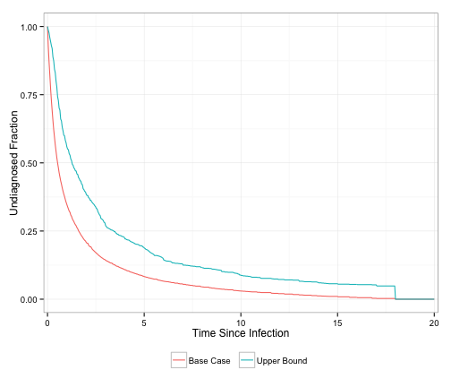
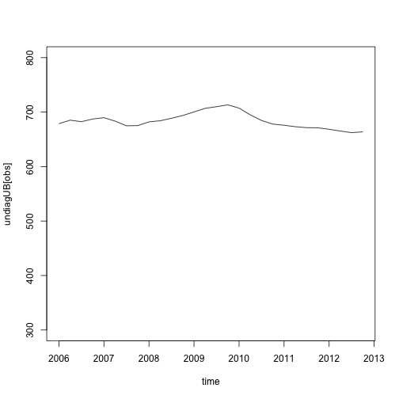
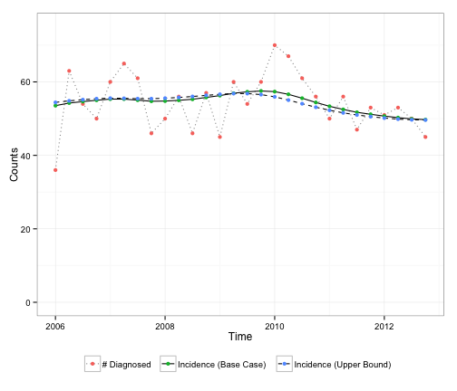
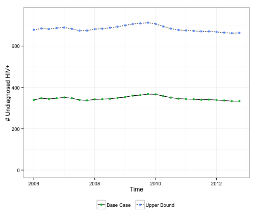

Undiagnosed HIV in King County MSM
========================================================
Replication of Ian Fellow's analysis
Jeanette Birnbaum 5/2014

Figure 1
------------------------


 


```
## lambda: 54.4 54.4 54.4 54.4 54.4 54.4 54.4 54.4 54.4 54.4 54.4 54.4 54.4 54.4 54.4 54.4 54.4 54.4 54.4 54.4 54.4 54.4 54.4 54.4 54.4 54.4 54.4 54.4 54.4 54.4 54.4 54.4 54.4 54.4 54.4 54.4 54.4 54.4 54.4 54.4 54.4 54.4 54.4 54.4 54.4 54.4 54.4 54.4 54.4 54.4 54.4 54.4 54.4 54.4 54.4 54.4 54.4 54.4 54.4 54.4 54.4 54.4 54.4 54.4 54.4 54.4 54.4 54.4 54.4 54.4 54.4 54.4 54.4 54.3 54.3 54.3 54.3 54.3 54.3 54.3 54.3 54.3 54.3 54.3 54.3 54.3 54.3 54.3 54.3 54.2 54.2 54.2 54.1 54.1 54.1 54 54 53.9 53.9 53.8 54 54.5 54.7 54.9 55.1 55.1 54.7 54.4 54.5 54.6 54.8 55.2 55.6 56.1 56.5 56.7 56.6 56 55.2 54.3 53.5 52.9 52.3 51.9 51.5 51.2 50.9 50.7
## parameter change: 1.537
## lambda: 54.4 54.4 54.4 54.4 54.4 54.4 54.4 54.4 54.4 54.4 54.4 54.4 54.4 54.4 54.4 54.4 54.4 54.4 54.4 54.4 54.4 54.4 54.4 54.4 54.4 54.4 54.4 54.4 54.3 54.3 54.4 54.4 54.3 54.4 54.4 54.4 54.3 54.3 54.4 54.4 54.3 54.3 54.4 54.4 54.4 54.4 54.4 54.4 54.4 54.4 54.4 54.4 54.4 54.4 54.4 54.4 54.4 54.4 54.4 54.4 54.3 54.3 54.3 54.4 54.3 54.3 54.3 54.3 54.3 54.3 54.3 54.3 54.3 54.3 54.3 54.3 54.3 54.3 54.3 54.3 54.3 54.3 54.3 54.3 54.2 54.2 54.2 54.2 54.1 54.1 54 54 53.9 53.8 53.8 53.7 53.7 53.6 53.6 53.6 53.8 54.4 54.7 54.9 55.2 55.2 54.8 54.5 54.5 54.7 55 55.5 56 56.6 57 57.2 57.1 56.4 55.4 54.3 53.3 52.5 51.8 51.3 50.8 50.4 50.1 49.9
## parameter change: 0.1013
## lambda: 54.4 54.4 54.4 54.4 54.4 54.4 54.4 54.4 54.4 54.4 54.4 54.4 54.4 54.4 54.4 54.4 54.4 54.4 54.4 54.4 54.4 54.4 54.4 54.4 54.4 54.4 54.4 54.3 54.3 54.3 54.3 54.3 54.3 54.3 54.4 54.3 54.3 54.3 54.3 54.3 54.3 54.3 54.4 54.4 54.4 54.4 54.4 54.4 54.4 54.4 54.4 54.4 54.4 54.4 54.4 54.4 54.4 54.3 54.3 54.3 54.3 54.3 54.3 54.3 54.3 54.3 54.3 54.3 54.3 54.3 54.3 54.3 54.3 54.3 54.3 54.3 54.3 54.3 54.3 54.3 54.2 54.2 54.2 54.2 54.2 54.1 54.1 54 54 53.9 53.9 53.8 53.7 53.6 53.6 53.5 53.5 53.4 53.4 53.5 53.7 54.3 54.6 54.9 55.2 55.2 54.9 54.6 54.6 54.8 55.1 55.6 56.1 56.7 57.1 57.4 57.2 56.5 55.4 54.3 53.3 52.5 51.7 51.2 50.7 50.3 49.9 49.7
## parameter change: 0.0147
## lambda: 54.4 54.4 54.4 54.4 54.4 54.4 54.4 54.4 54.4 54.4 54.4 54.4 54.4 54.4 54.4 54.4 54.4 54.4 54.4 54.4 54.4 54.4 54.4 54.4 54.4 54.3 54.3 54.3 54.3 54.3 54.3 54.3 54.3 54.3 54.3 54.3 54.3 54.3 54.3 54.3 54.3 54.3 54.3 54.4 54.4 54.4 54.4 54.4 54.4 54.4 54.4 54.4 54.4 54.4 54.4 54.4 54.3 54.3 54.3 54.3 54.3 54.3 54.3 54.3 54.3 54.3 54.3 54.3 54.3 54.3 54.3 54.3 54.3 54.3 54.3 54.3 54.3 54.2 54.2 54.2 54.2 54.2 54.1 54.1 54.1 54 54 53.9 53.9 53.8 53.7 53.6 53.6 53.5 53.4 53.4 53.3 53.3 53.3 53.4 53.7 54.3 54.6 54.9 55.2 55.2 54.9 54.6 54.6 54.8 55.1 55.6 56.1 56.8 57.2 57.4 57.2 56.5 55.5 54.3 53.3 52.4 51.7 51.1 50.6 50.2 49.9 49.7
## parameter change: 0.006293
## lambda: 54.4 54.4 54.4 54.4 54.4 54.4 54.4 54.4 54.4 54.4 54.4 54.4 54.4 54.4 54.4 54.4 54.4 54.4 54.4 54.4 54.4 54.4 54.4 54.4 54.3 54.3 54.3 54.3 54.3 54.3 54.3 54.3 54.3 54.3 54.3 54.3 54.3 54.3 54.3 54.3 54.3 54.3 54.3 54.3 54.4 54.4 54.4 54.4 54.4 54.4 54.4 54.4 54.4 54.3 54.3 54.3 54.3 54.3 54.3 54.3 54.3 54.3 54.3 54.3 54.3 54.3 54.3 54.3 54.3 54.3 54.3 54.3 54.3 54.3 54.2 54.2 54.2 54.2 54.2 54.1 54.1 54.1 54.1 54 54 53.9 53.9 53.8 53.7 53.7 53.6 53.5 53.4 53.4 53.3 53.2 53.2 53.2 53.2 53.3 53.6 54.3 54.6 54.9 55.2 55.2 54.9 54.6 54.6 54.9 55.1 55.6 56.2 56.8 57.2 57.4 57.3 56.5 55.5 54.3 53.3 52.4 51.7 51.1 50.6 50.2 49.9 49.7
## parameter change: 0.004156
## lambda: 54.4 54.4 54.4 54.4 54.4 54.4 54.4 54.4 54.4 54.4 54.4 54.4 54.4 54.4 54.4 54.4 54.4 54.4 54.4 54.4 54.4 54.4 54.3 54.3 54.3 54.3 54.3 54.3 54.3 54.3 54.3 54.3 54.3 54.3 54.3 54.3 54.3 54.3 54.3 54.3 54.3 54.3 54.3 54.3 54.3 54.4 54.4 54.4 54.4 54.4 54.4 54.4 54.3 54.3 54.3 54.3 54.3 54.3 54.3 54.3 54.3 54.3 54.3 54.3 54.3 54.3 54.3 54.3 54.3 54.3 54.3 54.3 54.2 54.2 54.2 54.2 54.2 54.1 54.1 54.1 54.1 54 54 53.9 53.9 53.8 53.8 53.7 53.6 53.6 53.5 53.4 53.3 53.3 53.2 53.2 53.1 53.1 53.2 53.3 53.6 54.2 54.6 54.9 55.2 55.2 54.9 54.6 54.7 54.9 55.1 55.7 56.2 56.8 57.2 57.4 57.3 56.5 55.5 54.3 53.3 52.4 51.7 51.1 50.6 50.2 49.9 49.7
## parameter change: 0.003073
## lambda: 54.4 54.4 54.4 54.4 54.4 54.4 54.4 54.4 54.4 54.4 54.4 54.4 54.4 54.4 54.4 54.4 54.4 54.4 54.4 54.4 54.4 54.3 54.3 54.3 54.3 54.3 54.3 54.3 54.3 54.3 54.3 54.3 54.3 54.3 54.3 54.3 54.3 54.3 54.3 54.3 54.3 54.3 54.3 54.3 54.3 54.3 54.4 54.4 54.4 54.4 54.4 54.3 54.3 54.3 54.3 54.3 54.3 54.3 54.3 54.3 54.3 54.3 54.3 54.3 54.3 54.3 54.3 54.3 54.3 54.3 54.2 54.2 54.2 54.2 54.2 54.1 54.1 54.1 54.1 54 54 54 53.9 53.9 53.8 53.8 53.7 53.6 53.6 53.5 53.4 53.3 53.2 53.2 53.1 53.1 53.1 53.1 53.1 53.3 53.6 54.2 54.6 54.9 55.2 55.2 54.9 54.6 54.7 54.9 55.2 55.7 56.2 56.8 57.2 57.5 57.3 56.5 55.5 54.3 53.3 52.4 51.7 51.1 50.6 50.2 49.9 49.7
## parameter change: 0.002395
## lambda: 54.4 54.4 54.4 54.4 54.4 54.4 54.4 54.4 54.4 54.4 54.4 54.4 54.4 54.4 54.4 54.4 54.4 54.4 54.4 54.4 54.3 54.3 54.3 54.3 54.3 54.3 54.3 54.3 54.3 54.3 54.3 54.3 54.3 54.3 54.3 54.3 54.3 54.3 54.3 54.3 54.3 54.3 54.3 54.3 54.3 54.3 54.4 54.4 54.4 54.4 54.3 54.3 54.3 54.3 54.3 54.3 54.3 54.3 54.3 54.3 54.3 54.3 54.3 54.3 54.3 54.3 54.3 54.3 54.2 54.2 54.2 54.2 54.2 54.2 54.1 54.1 54.1 54 54 54 53.9 53.9 53.8 53.8 53.7 53.7 53.6 53.5 53.5 53.4 53.3 53.2 53.2 53.1 53.1 53 53 53.1 53.1 53.3 53.6 54.2 54.6 54.9 55.2 55.2 54.9 54.6 54.7 54.9 55.2 55.7 56.2 56.8 57.2 57.5 57.3 56.6 55.5 54.4 53.3 52.5 51.7 51.1 50.6 50.2 49.9 49.7
## parameter change: 0.001933
## lambda: 54.4 54.4 54.4 54.4 54.4 54.4 54.4 54.4 54.4 54.4 54.4 54.4 54.4 54.4 54.4 54.4 54.4 54.4 54.4 54.3 54.3 54.3 54.3 54.3 54.3 54.3 54.3 54.3 54.3 54.3 54.3 54.3 54.3 54.3 54.3 54.3 54.3 54.3 54.3 54.3 54.3 54.3 54.3 54.3 54.3 54.3 54.3 54.3 54.3 54.3 54.3 54.3 54.3 54.3 54.3 54.3 54.3 54.3 54.3 54.3 54.3 54.3 54.3 54.3 54.3 54.3 54.2 54.2 54.2 54.2 54.2 54.2 54.1 54.1 54.1 54.1 54 54 54 53.9 53.9 53.8 53.8 53.7 53.7 53.6 53.6 53.5 53.4 53.3 53.3 53.2 53.1 53.1 53 53 53 53 53.1 53.2 53.6 54.2 54.6 54.9 55.2 55.2 54.9 54.6 54.7 54.9 55.2 55.7 56.2 56.8 57.2 57.5 57.3 56.6 55.5 54.4 53.3 52.5 51.7 51.1 50.6 50.2 49.9 49.7
## parameter change: 0.001602
## lambda: 54.4 54.4 54.4 54.4 54.4 54.4 54.4 54.4 54.4 54.4 54.4 54.4 54.4 54.4 54.4 54.4 54.4 54.4 54.3 54.3 54.3 54.3 54.3 54.3 54.3 54.3 54.3 54.3 54.3 54.3 54.3 54.3 54.3 54.3 54.3 54.3 54.3 54.3 54.3 54.3 54.3 54.3 54.3 54.3 54.3 54.3 54.3 54.3 54.3 54.3 54.3 54.3 54.3 54.3 54.3 54.3 54.3 54.3 54.3 54.3 54.3 54.3 54.3 54.3 54.2 54.2 54.2 54.2 54.2 54.2 54.2 54.1 54.1 54.1 54.1 54 54 54 53.9 53.9 53.8 53.8 53.7 53.7 53.6 53.6 53.5 53.4 53.3 53.3 53.2 53.1 53.1 53 53 53 53 53 53.1 53.2 53.6 54.2 54.6 54.9 55.2 55.2 54.9 54.6 54.7 54.9 55.2 55.7 56.2 56.8 57.2 57.5 57.3 56.6 55.5 54.4 53.3 52.5 51.7 51.1 50.6 50.2 49.9 49.7
## parameter change: 0.001354
## lambda: 54.4 54.4 54.4 54.4 54.4 54.4 54.4 54.4 54.4 54.4 54.4 54.4 54.4 54.4 54.4 54.4 54.3 54.3 54.3 54.3 54.3 54.3 54.3 54.3 54.3 54.3 54.3 54.3 54.3 54.3 54.3 54.3 54.3 54.3 54.3 54.3 54.3 54.3 54.3 54.3 54.3 54.3 54.3 54.3 54.3 54.3 54.3 54.3 54.3 54.3 54.3 54.3 54.3 54.3 54.3 54.3 54.3 54.3 54.3 54.3 54.3 54.3 54.3 54.2 54.2 54.2 54.2 54.2 54.2 54.2 54.1 54.1 54.1 54 54 54 53.9 53.9 53.9 53.8 53.8 53.7 53.7 53.6 53.6 53.5 53.4 53.4 53.3 53.2 53.2 53.1 53 53 53 52.9 52.9 53 53.1 53.2 53.5 54.2 54.6 54.9 55.2 55.2 54.9 54.6 54.7 54.9 55.2 55.7 56.2 56.8 57.2 57.5 57.3 56.6 55.5 54.4 53.3 52.5 51.7 51.1 50.6 50.2 49.9 49.7
## parameter change: 0.001164
## lambda: 54.4 54.4 54.4 54.4 54.4 54.4 54.4 54.4 54.4 54.4 54.4 54.4 54.4 54.4 54.4 54.3 54.3 54.3 54.3 54.3 54.3 54.3 54.3 54.3 54.3 54.3 54.3 54.3 54.3 54.3 54.3 54.3 54.3 54.3 54.3 54.3 54.3 54.3 54.3 54.3 54.3 54.3 54.3 54.3 54.3 54.3 54.3 54.3 54.3 54.3 54.3 54.3 54.3 54.3 54.3 54.3 54.3 54.3 54.3 54.3 54.3 54.2 54.2 54.2 54.2 54.2 54.2 54.2 54.1 54.1 54.1 54.1 54 54 54 53.9 53.9 53.9 53.8 53.8 53.7 53.7 53.6 53.6 53.5 53.4 53.4 53.3 53.2 53.2 53.1 53 53 52.9 52.9 52.9 52.9 53 53 53.2 53.5 54.2 54.6 54.9 55.2 55.2 54.9 54.7 54.7 54.9 55.2 55.7 56.2 56.8 57.2 57.5 57.3 56.6 55.5 54.4 53.3 52.5 51.7 51.1 50.6 50.2 49.9 49.7
## parameter change: 0.001014
## lambda: 54.4 54.4 54.4 54.4 54.4 54.4 54.4 54.4 54.4 54.4 54.4 54.4 54.4 54.4 54.3 54.3 54.3 54.3 54.3 54.3 54.3 54.3 54.3 54.3 54.3 54.3 54.3 54.3 54.3 54.3 54.3 54.3 54.3 54.3 54.3 54.3 54.3 54.3 54.3 54.3 54.3 54.3 54.3 54.3 54.3 54.3 54.3 54.3 54.3 54.3 54.3 54.3 54.3 54.3 54.3 54.3 54.3 54.3 54.3 54.3 54.2 54.2 54.2 54.2 54.2 54.2 54.2 54.1 54.1 54.1 54.1 54 54 54 53.9 53.9 53.9 53.8 53.8 53.7 53.7 53.6 53.6 53.5 53.5 53.4 53.3 53.3 53.2 53.1 53.1 53 53 52.9 52.9 52.9 52.9 52.9 53 53.2 53.5 54.2 54.6 54.9 55.2 55.2 54.9 54.7 54.7 54.9 55.2 55.7 56.2 56.9 57.3 57.5 57.3 56.6 55.5 54.4 53.3 52.5 51.7 51.1 50.7 50.2 49.9 49.7
## parameter change: 0.0008932
## lambda: 54.4 54.4 54.4 54.4 54.4 54.4 54.4 54.4 54.4 54.4 54.4 54.4 54.4 54.3 54.3 54.3 54.3 54.3 54.3 54.3 54.3 54.3 54.3 54.3 54.3 54.3 54.3 54.3 54.3 54.3 54.3 54.3 54.3 54.3 54.3 54.3 54.3 54.3 54.3 54.3 54.3 54.3 54.3 54.3 54.3 54.3 54.3 54.3 54.3 54.3 54.3 54.3 54.3 54.3 54.3 54.3 54.3 54.3 54.3 54.2 54.2 54.2 54.2 54.2 54.2 54.2 54.1 54.1 54.1 54.1 54 54 54 53.9 53.9 53.9 53.8 53.8 53.7 53.7 53.6 53.6 53.5 53.5 53.4 53.4 53.3 53.2 53.2 53.1 53 53 52.9 52.9 52.9 52.9 52.9 52.9 53 53.2 53.5 54.2 54.6 54.9 55.2 55.2 55 54.7 54.7 54.9 55.2 55.7 56.2 56.9 57.3 57.5 57.3 56.6 55.5 54.4 53.3 52.5 51.7 51.1 50.7 50.2 49.9 49.7
## parameter change: 0.0007944
## lambda: 54.4 54.4 54.4 54.4 54.4 54.4 54.4 54.4 54.4 54.4 54.4 54.4 54.3 54.3 54.3 54.3 54.3 54.3 54.3 54.3 54.3 54.3 54.3 54.3 54.3 54.3 54.3 54.3 54.3 54.3 54.3 54.3 54.3 54.3 54.3 54.3 54.3 54.3 54.3 54.3 54.3 54.3 54.3 54.3 54.3 54.3 54.3 54.3 54.3 54.3 54.3 54.3 54.3 54.3 54.3 54.3 54.3 54.3 54.2 54.2 54.2 54.2 54.2 54.2 54.2 54.1 54.1 54.1 54.1 54 54 54 53.9 53.9 53.9 53.8 53.8 53.7 53.7 53.6 53.6 53.5 53.5 53.4 53.4 53.3 53.3 53.2 53.1 53.1 53 52.9 52.9 52.9 52.9 52.9 52.9 52.9 53 53.2 53.5 54.2 54.6 54.9 55.3 55.2 55 54.7 54.7 54.9 55.2 55.7 56.2 56.9 57.3 57.5 57.3 56.6 55.5 54.4 53.3 52.5 51.7 51.1 50.7 50.2 49.9 49.7
## parameter change: 0.0007123
## lambda: 54.4 54.4 54.4 54.4 54.4 54.4 54.4 54.4 54.4 54.4 54.4 54.3 54.3 54.3 54.3 54.3 54.3 54.3 54.3 54.3 54.3 54.3 54.3 54.3 54.3 54.3 54.3 54.3 54.3 54.3 54.3 54.3 54.3 54.3 54.3 54.3 54.3 54.3 54.3 54.3 54.3 54.3 54.3 54.3 54.3 54.3 54.3 54.3 54.3 54.3 54.3 54.3 54.3 54.3 54.3 54.3 54.3 54.2 54.2 54.2 54.2 54.2 54.2 54.2 54.1 54.1 54.1 54.1 54 54 54 54 53.9 53.9 53.8 53.8 53.8 53.7 53.7 53.6 53.6 53.5 53.4 53.4 53.3 53.3 53.2 53.2 53.1 53 53 52.9 52.9 52.8 52.8 52.8 52.9 52.9 53 53.2 53.5 54.2 54.6 54.9 55.3 55.3 55 54.7 54.7 54.9 55.2 55.7 56.2 56.9 57.3 57.5 57.3 56.6 55.5 54.4 53.3 52.5 51.7 51.2 50.7 50.2 49.9 49.7
## parameter change: 0.0006433
## lambda: 54.4 54.4 54.4 54.4 54.4 54.4 54.4 54.4 54.4 54.4 54.3 54.3 54.3 54.3 54.3 54.3 54.3 54.3 54.3 54.3 54.3 54.3 54.3 54.3 54.3 54.3 54.3 54.3 54.3 54.3 54.3 54.3 54.3 54.3 54.3 54.3 54.3 54.3 54.3 54.3 54.3 54.3 54.3 54.3 54.3 54.3 54.3 54.3 54.3 54.3 54.3 54.3 54.3 54.3 54.3 54.3 54.2 54.2 54.2 54.2 54.2 54.2 54.1 54.1 54.1 54.1 54.1 54 54 54 54 53.9 53.9 53.8 53.8 53.8 53.7 53.7 53.6 53.6 53.5 53.5 53.4 53.4 53.3 53.2 53.2 53.1 53.1 53 52.9 52.9 52.9 52.8 52.8 52.8 52.8 52.9 53 53.2 53.5 54.2 54.6 54.9 55.3 55.3 55 54.7 54.7 54.9 55.2 55.7 56.2 56.9 57.3 57.5 57.3 56.6 55.5 54.4 53.3 52.5 51.7 51.2 50.7 50.2 49.9 49.7
## parameter change: 0.0005847
## lambda: 54.4 54.4 54.4 54.4 54.4 54.4 54.4 54.4 54.3 54.3 54.3 54.3 54.3 54.3 54.3 54.3 54.3 54.3 54.3 54.3 54.3 54.3 54.3 54.3 54.3 54.3 54.3 54.3 54.3 54.3 54.3 54.3 54.3 54.3 54.3 54.3 54.3 54.3 54.3 54.3 54.3 54.3 54.3 54.3 54.3 54.3 54.3 54.3 54.3 54.3 54.3 54.3 54.3 54.3 54.3 54.2 54.2 54.2 54.2 54.2 54.2 54.1 54.1 54.1 54.1 54.1 54 54 54 54 53.9 53.9 53.9 53.8 53.8 53.7 53.7 53.6 53.6 53.5 53.5 53.4 53.4 53.3 53.3 53.2 53.2 53.1 53 53 52.9 52.9 52.8 52.8 52.8 52.8 52.8 52.9 53 53.2 53.5 54.2 54.6 55 55.3 55.3 55 54.7 54.7 54.9 55.2 55.7 56.2 56.9 57.3 57.5 57.3 56.6 55.5 54.4 53.3 52.5 51.7 51.2 50.7 50.3 49.9 49.7
## parameter change: 0.0005344
## lambda: 54.4 54.4 54.4 54.4 54.4 54.4 54.4 54.3 54.3 54.3 54.3 54.3 54.3 54.3 54.3 54.3 54.3 54.3 54.3 54.3 54.3 54.3 54.3 54.3 54.3 54.3 54.3 54.3 54.3 54.3 54.3 54.3 54.3 54.3 54.3 54.3 54.3 54.3 54.3 54.3 54.3 54.3 54.3 54.3 54.3 54.3 54.3 54.3 54.3 54.3 54.3 54.3 54.3 54.3 54.2 54.2 54.2 54.2 54.2 54.2 54.1 54.1 54.1 54.1 54.1 54 54 54 54 53.9 53.9 53.9 53.8 53.8 53.7 53.7 53.7 53.6 53.6 53.5 53.5 53.4 53.3 53.3 53.2 53.2 53.1 53.1 53 53 52.9 52.9 52.8 52.8 52.8 52.8 52.8 52.9 53 53.2 53.5 54.2 54.6 55 55.3 55.3 55 54.7 54.7 54.9 55.2 55.7 56.2 56.9 57.3 57.5 57.3 56.6 55.5 54.4 53.3 52.5 51.7 51.2 50.7 50.3 49.9 49.7
## parameter change: 0.0004908
## lambda: 54.4 54.4 54.4 54.4 54.3 54.3 54.3 54.3 54.3 54.3 54.3 54.3 54.3 54.3 54.3 54.3 54.3 54.3 54.3 54.3 54.3 54.3 54.3 54.3 54.3 54.3 54.3 54.3 54.3 54.3 54.3 54.3 54.3 54.3 54.3 54.3 54.3 54.3 54.3 54.3 54.3 54.3 54.3 54.3 54.3 54.3 54.3 54.3 54.3 54.3 54.3 54.3 54.3 54.2 54.2 54.2 54.2 54.2 54.2 54.2 54.1 54.1 54.1 54.1 54 54 54 54 53.9 53.9 53.9 53.8 53.8 53.8 53.7 53.7 53.6 53.6 53.5 53.5 53.4 53.4 53.3 53.3 53.2 53.2 53.1 53 53 52.9 52.9 52.8 52.8 52.8 52.8 52.8 52.8 52.9 53 53.2 53.5 54.2 54.6 55 55.3 55.3 55 54.7 54.7 54.9 55.2 55.7 56.2 56.9 57.3 57.5 57.3 56.6 55.5 54.4 53.3 52.5 51.7 51.2 50.7 50.3 49.9 49.7
## parameter change: 0.0004529
## lambda: 54.3 54.3 54.3 54.3 54.3 54.3 54.3 54.3 54.3 54.3 54.3 54.3 54.3 54.3 54.3 54.3 54.3 54.3 54.3 54.3 54.3 54.3 54.3 54.3 54.3 54.3 54.3 54.3 54.3 54.3 54.3 54.3 54.3 54.3 54.3 54.3 54.3 54.3 54.3 54.3 54.3 54.3 54.3 54.3 54.3 54.3 54.3 54.3 54.3 54.3 54.3 54.3 54.2 54.2 54.2 54.2 54.2 54.2 54.2 54.1 54.1 54.1 54.1 54.1 54 54 54 53.9 53.9 53.9 53.8 53.8 53.8 53.7 53.7 53.6 53.6 53.5 53.5 53.4 53.4 53.3 53.3 53.2 53.2 53.1 53.1 53 53 52.9 52.9 52.8 52.8 52.8 52.8 52.8 52.8 52.9 53 53.2 53.5 54.2 54.6 55 55.3 55.3 55 54.7 54.7 54.9 55.2 55.7 56.2 56.9 57.3 57.5 57.3 56.6 55.5 54.4 53.3 52.5 51.7 51.2 50.7 50.3 49.9 49.7
## parameter change: 0.0004195
## lambda: 54.3 54.3 54.3 54.3 54.3 54.3 54.3 54.3 54.3 54.3 54.3 54.3 54.3 54.3 54.3 54.3 54.3 54.3 54.3 54.3 54.3 54.3 54.3 54.3 54.3 54.3 54.3 54.3 54.3 54.3 54.3 54.3 54.3 54.3 54.3 54.3 54.3 54.3 54.3 54.3 54.3 54.3 54.3 54.3 54.3 54.3 54.3 54.3 54.3 54.3 54.3 54.2 54.2 54.2 54.2 54.2 54.2 54.2 54.1 54.1 54.1 54.1 54.1 54 54 54 54 53.9 53.9 53.9 53.8 53.8 53.7 53.7 53.7 53.6 53.6 53.5 53.5 53.4 53.4 53.3 53.3 53.2 53.2 53.1 53.1 53 52.9 52.9 52.8 52.8 52.8 52.8 52.8 52.8 52.8 52.9 53 53.2 53.5 54.2 54.6 55 55.3 55.3 55 54.7 54.7 54.9 55.2 55.7 56.2 56.9 57.3 57.5 57.3 56.6 55.5 54.4 53.3 52.5 51.7 51.2 50.7 50.3 49.9 49.7
## parameter change: 0.00039
## lambda: 54.3 54.3 54.3 54.3 54.3 54.3 54.3 54.3 54.3 54.3 54.3 54.3 54.3 54.3 54.3 54.3 54.3 54.3 54.3 54.3 54.3 54.3 54.3 54.3 54.3 54.3 54.3 54.3 54.3 54.3 54.3 54.3 54.3 54.3 54.3 54.3 54.3 54.3 54.3 54.3 54.3 54.3 54.3 54.3 54.3 54.3 54.3 54.3 54.3 54.3 54.2 54.2 54.2 54.2 54.2 54.2 54.2 54.1 54.1 54.1 54.1 54.1 54 54 54 54 53.9 53.9 53.9 53.8 53.8 53.8 53.7 53.7 53.6 53.6 53.5 53.5 53.4 53.4 53.3 53.3 53.2 53.2 53.1 53.1 53 53 52.9 52.9 52.8 52.8 52.8 52.7 52.7 52.8 52.8 52.9 53 53.2 53.5 54.2 54.6 55 55.3 55.3 55 54.7 54.7 54.9 55.2 55.7 56.2 56.9 57.3 57.5 57.3 56.6 55.5 54.4 53.3 52.5 51.7 51.2 50.7 50.3 49.9 49.7
## parameter change: 0.0003638
## lambda: 54.3 54.3 54.3 54.3 54.3 54.3 54.3 54.3 54.3 54.3 54.3 54.3 54.3 54.3 54.3 54.3 54.3 54.3 54.3 54.3 54.3 54.3 54.3 54.3 54.3 54.3 54.3 54.3 54.3 54.3 54.3 54.3 54.3 54.3 54.3 54.3 54.3 54.3 54.3 54.3 54.3 54.3 54.3 54.3 54.3 54.3 54.3 54.3 54.3 54.2 54.2 54.2 54.2 54.2 54.2 54.2 54.1 54.1 54.1 54.1 54.1 54 54 54 54 53.9 53.9 53.9 53.8 53.8 53.8 53.7 53.7 53.6 53.6 53.6 53.5 53.5 53.4 53.4 53.3 53.3 53.2 53.2 53.1 53.1 53 53 52.9 52.9 52.8 52.8 52.7 52.7 52.7 52.8 52.8 52.9 53 53.2 53.5 54.2 54.6 55 55.3 55.3 55 54.7 54.7 54.9 55.2 55.7 56.2 56.9 57.3 57.5 57.3 56.6 55.5 54.4 53.3 52.5 51.7 51.2 50.7 50.3 49.9 49.7
## parameter change: 0.0003404
## lambda: 54.3 54.3 54.3 54.3 54.3 54.3 54.3 54.3 54.3 54.3 54.3 54.3 54.3 54.3 54.3 54.3 54.3 54.3 54.3 54.3 54.3 54.3 54.3 54.3 54.3 54.3 54.3 54.3 54.3 54.3 54.3 54.3 54.3 54.3 54.3 54.3 54.3 54.3 54.3 54.3 54.3 54.3 54.3 54.3 54.3 54.3 54.3 54.3 54.2 54.2 54.2 54.2 54.2 54.2 54.2 54.2 54.1 54.1 54.1 54.1 54 54 54 54 53.9 53.9 53.9 53.9 53.8 53.8 53.8 53.7 53.7 53.6 53.6 53.5 53.5 53.4 53.4 53.3 53.3 53.2 53.2 53.1 53.1 53 53 52.9 52.9 52.8 52.8 52.8 52.7 52.7 52.7 52.7 52.8 52.9 53 53.2 53.5 54.2 54.6 55 55.3 55.3 55 54.7 54.7 54.9 55.2 55.7 56.2 56.9 57.3 57.5 57.3 56.6 55.5 54.4 53.3 52.5 51.7 51.2 50.7 50.3 49.9 49.7
## parameter change: 0.0003194
## lambda: 54.3 54.3 54.3 54.3 54.3 54.3 54.3 54.3 54.3 54.3 54.3 54.3 54.3 54.3 54.3 54.3 54.3 54.3 54.3 54.3 54.3 54.3 54.3 54.3 54.3 54.3 54.3 54.3 54.3 54.3 54.3 54.3 54.3 54.3 54.3 54.3 54.3 54.3 54.3 54.3 54.3 54.3 54.3 54.3 54.3 54.3 54.2 54.2 54.2 54.2 54.2 54.2 54.2 54.2 54.2 54.1 54.1 54.1 54.1 54.1 54 54 54 54 53.9 53.9 53.9 53.8 53.8 53.8 53.7 53.7 53.6 53.6 53.6 53.5 53.5 53.4 53.4 53.3 53.3 53.2 53.2 53.1 53.1 53 53 52.9 52.9 52.8 52.8 52.7 52.7 52.7 52.7 52.7 52.8 52.9 53 53.2 53.5 54.2 54.6 55 55.3 55.3 55 54.7 54.7 55 55.2 55.7 56.2 56.9 57.3 57.5 57.3 56.6 55.5 54.4 53.3 52.5 51.7 51.2 50.7 50.3 49.9 49.7
## parameter change: 0.0003005
## lambda: 54.3 54.3 54.3 54.3 54.3 54.3 54.3 54.3 54.3 54.3 54.3 54.3 54.3 54.3 54.3 54.3 54.3 54.3 54.3 54.3 54.3 54.3 54.3 54.3 54.3 54.3 54.3 54.3 54.3 54.3 54.3 54.3 54.3 54.3 54.3 54.3 54.3 54.3 54.3 54.3 54.3 54.3 54.3 54.3 54.2 54.2 54.2 54.2 54.2 54.2 54.2 54.2 54.2 54.2 54.1 54.1 54.1 54.1 54.1 54 54 54 54 53.9 53.9 53.9 53.9 53.8 53.8 53.7 53.7 53.7 53.6 53.6 53.5 53.5 53.4 53.4 53.4 53.3 53.2 53.2 53.2 53.1 53.1 53 53 52.9 52.9 52.8 52.8 52.7 52.7 52.7 52.7 52.7 52.8 52.8 53 53.2 53.5 54.2 54.6 55 55.3 55.3 55 54.7 54.7 55 55.2 55.7 56.2 56.9 57.3 57.5 57.3 56.6 55.5 54.4 53.3 52.5 51.7 51.2 50.7 50.3 49.9 49.7
## parameter change: 0.0002834
## lambda: 54.3 54.3 54.3 54.3 54.3 54.3 54.3 54.3 54.3 54.3 54.3 54.3 54.3 54.3 54.3 54.3 54.3 54.3 54.3 54.3 54.3 54.3 54.3 54.3 54.3 54.3 54.3 54.3 54.3 54.3 54.3 54.3 54.3 54.3 54.3 54.3 54.3 54.3 54.3 54.3 54.3 54.2 54.3 54.2 54.2 54.2 54.2 54.2 54.2 54.2 54.2 54.2 54.2 54.1 54.1 54.1 54.1 54.1 54 54 54 54 53.9 53.9 53.9 53.9 53.8 53.8 53.8 53.7 53.7 53.6 53.6 53.6 53.5 53.5 53.4 53.4 53.3 53.3 53.2 53.2 53.1 53.1 53 53 52.9 52.9 52.8 52.8 52.8 52.7 52.7 52.7 52.7 52.7 52.8 52.8 53 53.2 53.5 54.2 54.6 55 55.3 55.3 55 54.7 54.7 55 55.2 55.7 56.2 56.9 57.3 57.5 57.3 56.6 55.5 54.4 53.3 52.5 51.7 51.2 50.7 50.3 49.9 49.7
## parameter change: 0.0002678
## lambda: 54.3 54.3 54.3 54.3 54.3 54.3 54.3 54.3 54.3 54.3 54.3 54.3 54.3 54.3 54.3 54.3 54.3 54.3 54.3 54.3 54.3 54.3 54.3 54.3 54.3 54.3 54.3 54.3 54.3 54.3 54.3 54.3 54.3 54.3 54.3 54.3 54.3 54.3 54.3 54.3 54.2 54.2 54.2 54.2 54.2 54.2 54.2 54.2 54.2 54.2 54.2 54.2 54.1 54.1 54.1 54.1 54.1 54.1 54 54 54 54 53.9 53.9 53.9 53.8 53.8 53.8 53.7 53.7 53.7 53.6 53.6 53.5 53.5 53.5 53.4 53.4 53.3 53.3 53.2 53.2 53.1 53.1 53 53 52.9 52.9 52.8 52.8 52.7 52.7 52.7 52.7 52.7 52.7 52.8 52.8 53 53.2 53.5 54.2 54.6 55 55.3 55.3 55 54.7 54.7 55 55.2 55.7 56.2 56.9 57.3 57.5 57.3 56.6 55.5 54.4 53.3 52.5 51.7 51.2 50.7 50.3 49.9 49.7
## parameter change: 0.0002537
## lambda: 54.3 54.3 54.3 54.3 54.3 54.3 54.3 54.3 54.3 54.3 54.3 54.3 54.3 54.3 54.3 54.3 54.3 54.3 54.3 54.3 54.3 54.3 54.3 54.3 54.3 54.3 54.3 54.3 54.3 54.3 54.3 54.3 54.3 54.3 54.3 54.3 54.3 54.3 54.3 54.2 54.2 54.2 54.2 54.2 54.2 54.2 54.2 54.2 54.2 54.2 54.2 54.2 54.1 54.1 54.1 54.1 54.1 54 54 54 54 53.9 53.9 53.9 53.9 53.8 53.8 53.8 53.7 53.7 53.6 53.6 53.6 53.5 53.5 53.4 53.4 53.3 53.3 53.2 53.2 53.1 53.1 53.1 53 53 52.9 52.9 52.8 52.8 52.7 52.7 52.7 52.7 52.7 52.7 52.8 52.8 53 53.2 53.5 54.2 54.6 55 55.3 55.3 55 54.7 54.8 55 55.2 55.7 56.2 56.9 57.3 57.5 57.3 56.6 55.5 54.4 53.3 52.5 51.7 51.2 50.7 50.3 49.9 49.7
## parameter change: 0.0002407
## lambda: 54.3 54.3 54.3 54.3 54.3 54.3 54.3 54.3 54.3 54.3 54.3 54.3 54.3 54.3 54.3 54.3 54.3 54.3 54.3 54.3 54.3 54.3 54.3 54.3 54.3 54.3 54.3 54.3 54.3 54.3 54.3 54.3 54.3 54.3 54.3 54.3 54.3 54.3 54.2 54.2 54.2 54.2 54.2 54.2 54.2 54.2 54.2 54.2 54.2 54.2 54.2 54.1 54.1 54.1 54.1 54.1 54 54 54 54 53.9 53.9 53.9 53.9 53.8 53.8 53.8 53.7 53.7 53.7 53.6 53.6 53.5 53.5 53.5 53.4 53.4 53.3 53.3 53.2 53.2 53.1 53.1 53 53 52.9 52.9 52.9 52.8 52.8 52.7 52.7 52.7 52.7 52.7 52.7 52.8 52.8 53 53.2 53.5 54.2 54.6 55 55.3 55.3 55 54.7 54.8 55 55.2 55.7 56.2 56.9 57.3 57.5 57.3 56.6 55.5 54.4 53.3 52.5 51.7 51.2 50.7 50.3 49.9 49.7
## parameter change: 0.0002288
## lambda: 54.3 54.3 54.3 54.3 54.3 54.3 54.3 54.3 54.3 54.3 54.3 54.3 54.3 54.3 54.3 54.3 54.3 54.3 54.3 54.3 54.3 54.3 54.3 54.3 54.3 54.3 54.3 54.3 54.3 54.3 54.3 54.3 54.3 54.3 54.3 54.3 54.3 54.2 54.2 54.2 54.2 54.2 54.2 54.2 54.2 54.2 54.2 54.2 54.2 54.2 54.1 54.1 54.1 54.1 54.1 54.1 54 54 54 54 53.9 53.9 53.9 53.9 53.8 53.8 53.8 53.7 53.7 53.6 53.6 53.6 53.5 53.5 53.4 53.4 53.3 53.3 53.3 53.2 53.2 53.1 53.1 53 53 52.9 52.9 52.8 52.8 52.8 52.7 52.7 52.7 52.7 52.7 52.7 52.8 52.8 53 53.2 53.5 54.2 54.6 55 55.3 55.3 55 54.7 54.8 55 55.2 55.8 56.3 56.9 57.3 57.5 57.3 56.6 55.5 54.4 53.4 52.5 51.7 51.2 50.7 50.3 49.9 49.7
## parameter change: 0.0002179
## lambda: 54.3 54.3 54.3 54.3 54.3 54.3 54.3 54.3 54.3 54.3 54.3 54.3 54.3 54.3 54.3 54.3 54.3 54.3 54.3 54.3 54.3 54.3 54.3 54.3 54.3 54.3 54.3 54.3 54.3 54.3 54.3 54.3 54.3 54.3 54.3 54.3 54.2 54.2 54.2 54.2 54.2 54.2 54.2 54.2 54.2 54.2 54.2 54.2 54.2 54.2 54.1 54.1 54.1 54.1 54.1 54 54 54 54 53.9 53.9 53.9 53.9 53.8 53.8 53.8 53.7 53.7 53.7 53.6 53.6 53.6 53.5 53.5 53.4 53.4 53.3 53.3 53.2 53.2 53.1 53.1 53.1 53 53 52.9 52.9 52.8 52.8 52.7 52.7 52.7 52.7 52.7 52.7 52.7 52.8 52.8 53 53.2 53.5 54.2 54.6 55 55.3 55.3 55 54.7 54.8 55 55.2 55.8 56.3 56.9 57.3 57.5 57.3 56.6 55.5 54.4 53.4 52.5 51.7 51.2 50.7 50.3 49.9 49.7
## parameter change: 0.0002078
## lambda: 54.3 54.3 54.3 54.3 54.3 54.3 54.3 54.3 54.3 54.3 54.3 54.3 54.3 54.3 54.3 54.3 54.3 54.3 54.3 54.3 54.3 54.3 54.3 54.3 54.3 54.3 54.3 54.3 54.3 54.3 54.3 54.3 54.3 54.3 54.3 54.3 54.2 54.2 54.2 54.2 54.2 54.2 54.2 54.2 54.2 54.2 54.2 54.2 54.2 54.1 54.1 54.1 54.1 54.1 54.1 54 54 54 54 53.9 53.9 53.9 53.8 53.8 53.8 53.8 53.7 53.7 53.7 53.6 53.6 53.5 53.5 53.4 53.4 53.4 53.3 53.3 53.2 53.2 53.1 53.1 53 53 52.9 52.9 52.9 52.8 52.8 52.7 52.7 52.7 52.7 52.7 52.7 52.7 52.8 52.8 53 53.2 53.5 54.2 54.6 55 55.3 55.3 55 54.7 54.8 55 55.2 55.8 56.3 56.9 57.3 57.5 57.3 56.6 55.5 54.4 53.4 52.5 51.7 51.2 50.7 50.3 49.9 49.7
## parameter change: 0.0001985
## lambda: 54.3 54.3 54.3 54.3 54.3 54.3 54.3 54.3 54.3 54.3 54.3 54.3 54.3 54.3 54.3 54.3 54.3 54.3 54.3 54.3 54.3 54.3 54.3 54.3 54.3 54.3 54.3 54.3 54.3 54.3 54.3 54.3 54.3 54.3 54.3 54.2 54.2 54.2 54.2 54.2 54.2 54.2 54.2 54.2 54.2 54.2 54.2 54.2 54.1 54.1 54.1 54.1 54.1 54.1 54 54 54 54 53.9 53.9 53.9 53.9 53.8 53.8 53.8 53.7 53.7 53.7 53.6 53.6 53.6 53.5 53.5 53.4 53.4 53.3 53.3 53.2 53.2 53.2 53.1 53.1 53 53 52.9 52.9 52.9 52.8 52.8 52.7 52.7 52.7 52.6 52.6 52.7 52.7 52.7 52.8 53 53.2 53.5 54.2 54.6 55 55.3 55.3 55 54.7 54.8 55 55.2 55.8 56.3 56.9 57.3 57.5 57.3 56.6 55.5 54.4 53.4 52.5 51.7 51.2 50.7 50.3 49.9 49.7
## parameter change: 0.0001899
## lambda: 54.3 54.3 54.3 54.3 54.3 54.3 54.3 54.3 54.3 54.3 54.3 54.3 54.3 54.3 54.3 54.3 54.3 54.3 54.3 54.3 54.3 54.3 54.3 54.3 54.3 54.3 54.3 54.3 54.3 54.3 54.3 54.3 54.3 54.2 54.2 54.2 54.2 54.2 54.2 54.2 54.2 54.2 54.2 54.2 54.2 54.2 54.2 54.1 54.1 54.1 54.1 54.1 54.1 54 54 54 54 54 53.9 53.9 53.9 53.8 53.8 53.8 53.8 53.7 53.7 53.7 53.6 53.6 53.5 53.5 53.5 53.4 53.4 53.3 53.3 53.2 53.2 53.1 53.1 53 53 53 52.9 52.9 52.8 52.8 52.8 52.7 52.7 52.7 52.6 52.6 52.7 52.7 52.7 52.8 53 53.2 53.5 54.2 54.6 55 55.3 55.3 55 54.7 54.8 55 55.2 55.8 56.3 56.9 57.3 57.5 57.3 56.6 55.5 54.4 53.4 52.5 51.7 51.2 50.7 50.3 49.9 49.7
## parameter change: 0.0001819
## lambda: 54.3 54.3 54.3 54.3 54.3 54.3 54.3 54.3 54.3 54.3 54.3 54.3 54.3 54.3 54.3 54.3 54.3 54.3 54.3 54.3 54.3 54.3 54.3 54.3 54.3 54.3 54.3 54.3 54.3 54.3 54.3 54.3 54.2 54.2 54.2 54.2 54.2 54.2 54.2 54.2 54.2 54.2 54.2 54.2 54.2 54.2 54.2 54.1 54.1 54.1 54.1 54.1 54.1 54 54 54 54 53.9 53.9 53.9 53.9 53.8 53.8 53.8 53.7 53.7 53.7 53.6 53.6 53.6 53.5 53.5 53.4 53.4 53.4 53.3 53.3 53.2 53.2 53.1 53.1 53 53 53 52.9 52.9 52.8 52.8 52.7 52.7 52.7 52.7 52.6 52.6 52.7 52.7 52.7 52.8 53 53.2 53.5 54.2 54.6 55 55.3 55.3 55 54.7 54.8 55 55.3 55.8 56.3 56.9 57.3 57.5 57.3 56.6 55.5 54.4 53.4 52.5 51.7 51.2 50.7 50.3 49.9 49.7
## parameter change: 0.0001744
## lambda: 54.3 54.3 54.3 54.3 54.3 54.3 54.3 54.3 54.3 54.3 54.3 54.3 54.3 54.3 54.3 54.3 54.3 54.3 54.3 54.3 54.3 54.3 54.3 54.3 54.3 54.3 54.3 54.3 54.3 54.3 54.3 54.2 54.2 54.2 54.2 54.2 54.2 54.2 54.2 54.2 54.2 54.2 54.2 54.2 54.2 54.1 54.1 54.1 54.1 54.1 54.1 54.1 54 54 54 54 54 53.9 53.9 53.9 53.8 53.8 53.8 53.8 53.7 53.7 53.7 53.6 53.6 53.5 53.5 53.5 53.4 53.4 53.3 53.3 53.2 53.2 53.2 53.1 53.1 53 53 52.9 52.9 52.9 52.8 52.8 52.7 52.7 52.7 52.6 52.6 52.6 52.6 52.7 52.7 52.8 53 53.2 53.5 54.2 54.6 55 55.3 55.3 55 54.7 54.8 55 55.3 55.8 56.3 56.9 57.3 57.5 57.3 56.6 55.5 54.4 53.4 52.5 51.7 51.2 50.7 50.3 49.9 49.7
## parameter change: 0.0001675
## lambda: 54.3 54.3 54.3 54.3 54.3 54.3 54.3 54.3 54.3 54.3 54.3 54.3 54.3 54.3 54.3 54.3 54.3 54.3 54.3 54.3 54.3 54.3 54.3 54.3 54.3 54.3 54.3 54.3 54.3 54.3 54.2 54.2 54.2 54.2 54.2 54.2 54.2 54.2 54.2 54.2 54.2 54.2 54.2 54.2 54.1 54.1 54.1 54.1 54.1 54.1 54.1 54.1 54 54 54 54 53.9 53.9 53.9 53.9 53.8 53.8 53.8 53.7 53.7 53.7 53.6 53.6 53.6 53.5 53.5 53.5 53.4 53.4 53.3 53.3 53.2 53.2 53.1 53.1 53.1 53 53 52.9 52.9 52.8 52.8 52.8 52.7 52.7 52.7 52.6 52.6 52.6 52.6 52.7 52.7 52.8 52.9 53.2 53.5 54.2 54.6 55 55.3 55.3 55 54.7 54.8 55 55.3 55.8 56.3 56.9 57.3 57.5 57.3 56.6 55.5 54.4 53.4 52.5 51.7 51.2 50.7 50.3 49.9 49.7
## parameter change: 0.000161
## lambda: 54.3 54.3 54.3 54.3 54.3 54.3 54.3 54.3 54.3 54.3 54.3 54.3 54.3 54.3 54.3 54.3 54.3 54.3 54.3 54.3 54.3 54.3 54.3 54.3 54.3 54.3 54.3 54.3 54.3 54.2 54.2 54.2 54.2 54.2 54.2 54.2 54.2 54.2 54.2 54.2 54.2 54.2 54.2 54.1 54.1 54.1 54.1 54.1 54.1 54.1 54.1 54 54 54 54 54 53.9 53.9 53.9 53.8 53.8 53.8 53.8 53.7 53.7 53.7 53.6 53.6 53.6 53.5 53.5 53.4 53.4 53.3 53.3 53.3 53.2 53.2 53.1 53.1 53 53 53 52.9 52.9 52.8 52.8 52.8 52.7 52.7 52.7 52.6 52.6 52.6 52.6 52.7 52.7 52.8 52.9 53.2 53.5 54.2 54.6 55 55.3 55.3 55 54.7 54.8 55 55.3 55.8 56.3 56.9 57.3 57.5 57.3 56.6 55.5 54.4 53.4 52.5 51.7 51.2 50.7 50.3 49.9 49.7
## parameter change: 0.000155
## lambda: 54.3 54.3 54.3 54.3 54.3 54.3 54.3 54.3 54.3 54.3 54.3 54.3 54.3 54.3 54.3 54.3 54.3 54.3 54.3 54.3 54.3 54.3 54.3 54.3 54.3 54.3 54.3 54.3 54.2 54.2 54.2 54.2 54.2 54.2 54.2 54.2 54.2 54.2 54.2 54.2 54.2 54.2 54.1 54.1 54.1 54.1 54.1 54.1 54.1 54.1 54.1 54 54 54 54 53.9 53.9 53.9 53.9 53.8 53.8 53.8 53.7 53.7 53.7 53.6 53.6 53.6 53.5 53.5 53.5 53.4 53.4 53.3 53.3 53.3 53.2 53.2 53.1 53.1 53 53 52.9 52.9 52.9 52.8 52.8 52.8 52.7 52.7 52.6 52.6 52.6 52.6 52.6 52.7 52.7 52.8 52.9 53.2 53.5 54.2 54.6 55 55.3 55.3 55 54.7 54.8 55 55.3 55.8 56.3 56.9 57.3 57.5 57.3 56.6 55.5 54.4 53.4 52.5 51.7 51.2 50.7 50.3 49.9 49.7
## parameter change: 0.0001493
## lambda: 54.3 54.3 54.3 54.3 54.3 54.3 54.3 54.3 54.3 54.3 54.3 54.3 54.3 54.3 54.3 54.3 54.3 54.3 54.3 54.3 54.3 54.3 54.3 54.3 54.3 54.3 54.3 54.3 54.2 54.2 54.2 54.2 54.2 54.2 54.2 54.2 54.2 54.2 54.2 54.2 54.2 54.1 54.1 54.1 54.1 54.1 54.1 54.1 54.1 54.1 54 54 54 54 54 53.9 53.9 53.9 53.8 53.8 53.8 53.8 53.7 53.7 53.7 53.6 53.6 53.6 53.5 53.5 53.4 53.4 53.4 53.3 53.3 53.2 53.2 53.1 53.1 53.1 53 53 52.9 52.9 52.9 52.8 52.8 52.7 52.7 52.7 52.6 52.6 52.6 52.6 52.6 52.7 52.7 52.8 52.9 53.2 53.5 54.2 54.6 55 55.3 55.3 55 54.7 54.8 55 55.3 55.8 56.3 56.9 57.3 57.5 57.3 56.6 55.5 54.4 53.4 52.5 51.7 51.2 50.7 50.3 49.9 49.7
## parameter change: 0.000144
## lambda: 54.3 54.3 54.3 54.3 54.3 54.3 54.3 54.3 54.3 54.3 54.3 54.3 54.3 54.3 54.3 54.3 54.3 54.3 54.3 54.3 54.3 54.3 54.3 54.3 54.3 54.3 54.3 54.2 54.2 54.2 54.2 54.2 54.2 54.2 54.2 54.2 54.2 54.2 54.2 54.2 54.1 54.1 54.1 54.1 54.1 54.1 54.1 54.1 54.1 54 54 54 54 54 53.9 53.9 53.9 53.9 53.8 53.8 53.8 53.7 53.7 53.7 53.7 53.6 53.6 53.6 53.5 53.5 53.4 53.4 53.4 53.3 53.3 53.2 53.2 53.1 53.1 53.1 53 53 52.9 52.9 52.8 52.8 52.8 52.7 52.7 52.7 52.6 52.6 52.6 52.6 52.6 52.7 52.7 52.8 52.9 53.2 53.5 54.2 54.6 55 55.3 55.3 55 54.7 54.8 55 55.3 55.8 56.3 56.9 57.3 57.5 57.3 56.6 55.5 54.4 53.4 52.5 51.7 51.2 50.7 50.3 49.9 49.7
## parameter change: 0.000139
## lambda: 54.3 54.3 54.3 54.3 54.3 54.3 54.3 54.3 54.3 54.3 54.3 54.3 54.3 54.3 54.3 54.3 54.3 54.3 54.3 54.3 54.3 54.3 54.3 54.3 54.3 54.3 54.2 54.2 54.2 54.2 54.2 54.2 54.2 54.2 54.2 54.2 54.2 54.2 54.2 54.2 54.1 54.1 54.1 54.1 54.1 54.1 54.1 54.1 54.1 54 54 54 54 54 53.9 53.9 53.9 53.8 53.8 53.8 53.8 53.7 53.7 53.7 53.6 53.6 53.6 53.5 53.5 53.5 53.4 53.4 53.3 53.3 53.3 53.2 53.2 53.1 53.1 53 53 53 52.9 52.9 52.8 52.8 52.8 52.7 52.7 52.7 52.6 52.6 52.6 52.6 52.6 52.7 52.7 52.8 52.9 53.2 53.5 54.2 54.6 55 55.3 55.3 55 54.7 54.8 55 55.3 55.8 56.3 56.9 57.3 57.5 57.3 56.6 55.6 54.4 53.4 52.5 51.7 51.2 50.7 50.3 49.9 49.7
## parameter change: 0.0001343
## lambda: 54.3 54.3 54.3 54.3 54.3 54.3 54.3 54.3 54.3 54.3 54.3 54.3 54.3 54.3 54.3 54.3 54.3 54.3 54.3 54.3 54.3 54.3 54.3 54.3 54.3 54.3 54.2 54.2 54.2 54.2 54.2 54.2 54.2 54.2 54.2 54.2 54.2 54.2 54.2 54.1 54.1 54.1 54.1 54.1 54.1 54.1 54.1 54.1 54 54 54 54 54 53.9 53.9 53.9 53.9 53.8 53.8 53.8 53.7 53.7 53.7 53.7 53.6 53.6 53.6 53.5 53.5 53.4 53.4 53.4 53.3 53.3 53.2 53.2 53.2 53.1 53.1 53 53 52.9 52.9 52.9 52.8 52.8 52.8 52.7 52.7 52.7 52.6 52.6 52.6 52.6 52.6 52.7 52.7 52.8 52.9 53.2 53.5 54.2 54.6 55 55.3 55.3 55 54.7 54.8 55 55.3 55.8 56.3 56.9 57.3 57.5 57.3 56.6 55.6 54.4 53.4 52.5 51.7 51.2 50.7 50.3 49.9 49.7
## parameter change: 0.0001299
## lambda: 54.3 54.3 54.3 54.3 54.3 54.3 54.3 54.3 54.3 54.3 54.3 54.3 54.3 54.3 54.3 54.3 54.3 54.3 54.3 54.3 54.3 54.3 54.3 54.3 54.3 54.2 54.2 54.2 54.2 54.2 54.2 54.2 54.2 54.2 54.2 54.2 54.2 54.2 54.1 54.1 54.1 54.1 54.1 54.1 54.1 54.1 54.1 54.1 54 54 54 54 54 53.9 53.9 53.9 53.9 53.8 53.8 53.8 53.7 53.7 53.7 53.6 53.6 53.6 53.5 53.5 53.5 53.4 53.4 53.4 53.3 53.3 53.2 53.2 53.1 53.1 53.1 53 53 52.9 52.9 52.9 52.8 52.8 52.8 52.7 52.7 52.6 52.6 52.6 52.6 52.6 52.6 52.7 52.7 52.8 52.9 53.2 53.5 54.2 54.6 55 55.3 55.3 55 54.7 54.8 55 55.3 55.8 56.3 56.9 57.3 57.5 57.3 56.6 55.6 54.4 53.4 52.5 51.7 51.2 50.7 50.3 49.9 49.7
## parameter change: 0.0001257
## lambda: 54.3 54.3 54.3 54.3 54.3 54.3 54.3 54.3 54.3 54.3 54.3 54.3 54.3 54.3 54.3 54.3 54.3 54.3 54.3 54.3 54.3 54.3 54.3 54.3 54.2 54.2 54.2 54.2 54.2 54.2 54.2 54.2 54.2 54.2 54.2 54.2 54.2 54.2 54.1 54.1 54.1 54.1 54.1 54.1 54.1 54.1 54.1 54 54 54 54 54 53.9 53.9 53.9 53.9 53.8 53.8 53.8 53.8 53.7 53.7 53.7 53.6 53.6 53.6 53.5 53.5 53.5 53.4 53.4 53.3 53.3 53.3 53.2 53.2 53.1 53.1 53.1 53 53 52.9 52.9 52.9 52.8 52.8 52.7 52.7 52.7 52.6 52.6 52.6 52.6 52.6 52.6 52.7 52.7 52.8 52.9 53.2 53.5 54.2 54.6 55 55.3 55.3 55 54.7 54.8 55 55.3 55.8 56.3 56.9 57.3 57.5 57.3 56.6 55.6 54.4 53.4 52.5 51.7 51.2 50.7 50.3 49.9 49.7
## parameter change: 0.0001218
## lambda: 54.3 54.3 54.3 54.3 54.3 54.3 54.3 54.3 54.3 54.3 54.3 54.3 54.3 54.3 54.3 54.3 54.3 54.3 54.3 54.3 54.3 54.3 54.3 54.3 54.2 54.2 54.2 54.2 54.2 54.2 54.2 54.2 54.2 54.2 54.2 54.2 54.2 54.1 54.1 54.1 54.1 54.1 54.1 54.1 54.1 54.1 54 54 54 54 54 54 53.9 53.9 53.9 53.9 53.8 53.8 53.8 53.7 53.7 53.7 53.7 53.6 53.6 53.6 53.5 53.5 53.4 53.4 53.4 53.3 53.3 53.2 53.2 53.2 53.1 53.1 53 53 53 52.9 52.9 52.8 52.8 52.8 52.7 52.7 52.7 52.6 52.6 52.6 52.6 52.6 52.6 52.7 52.7 52.8 52.9 53.2 53.5 54.2 54.6 55 55.3 55.3 55 54.7 54.8 55 55.3 55.8 56.3 56.9 57.3 57.5 57.3 56.6 55.6 54.4 53.4 52.5 51.7 51.2 50.7 50.3 49.9 49.7
## parameter change: 0.0001181
## lambda: 54.3 54.3 54.3 54.3 54.3 54.3 54.3 54.3 54.3 54.3 54.3 54.3 54.3 54.3 54.3 54.3 54.3 54.3 54.3 54.3 54.3 54.3 54.3 54.2 54.2 54.2 54.2 54.2 54.2 54.2 54.2 54.2 54.2 54.2 54.2 54.2 54.1 54.1 54.1 54.1 54.1 54.1 54.1 54.1 54.1 54 54 54 54 54 54 53.9 53.9 53.9 53.9 53.8 53.8 53.8 53.8 53.7 53.7 53.7 53.6 53.6 53.6 53.5 53.5 53.5 53.4 53.4 53.4 53.3 53.3 53.2 53.2 53.2 53.1 53.1 53 53 52.9 52.9 52.9 52.8 52.8 52.8 52.7 52.7 52.7 52.6 52.6 52.6 52.6 52.6 52.6 52.7 52.7 52.8 52.9 53.2 53.5 54.2 54.6 55 55.3 55.3 55 54.7 54.8 55 55.3 55.8 56.3 56.9 57.3 57.5 57.4 56.6 55.6 54.4 53.4 52.5 51.7 51.2 50.7 50.3 49.9 49.7
## parameter change: 0.0001146
## lambda: 54.3 54.3 54.3 54.3 54.3 54.3 54.3 54.3 54.3 54.3 54.3 54.3 54.3 54.3 54.3 54.3 54.3 54.3 54.3 54.3 54.3 54.3 54.2 54.2 54.2 54.2 54.2 54.2 54.2 54.2 54.2 54.2 54.2 54.2 54.2 54.2 54.1 54.1 54.1 54.1 54.1 54.1 54.1 54.1 54.1 54 54 54 54 54 54 53.9 53.9 53.9 53.9 53.8 53.8 53.8 53.8 53.7 53.7 53.7 53.6 53.6 53.6 53.5 53.5 53.5 53.4 53.4 53.3 53.3 53.3 53.2 53.2 53.1 53.1 53.1 53 53 52.9 52.9 52.9 52.8 52.8 52.8 52.7 52.7 52.7 52.6 52.6 52.6 52.6 52.6 52.6 52.7 52.7 52.8 52.9 53.2 53.5 54.2 54.6 55 55.3 55.3 55 54.7 54.8 55 55.3 55.8 56.3 56.9 57.3 57.5 57.4 56.6 55.6 54.4 53.4 52.5 51.7 51.2 50.7 50.3 49.9 49.7
## parameter change: 0.0001113
## lambda: 54.3 54.3 54.3 54.3 54.3 54.3 54.3 54.3 54.3 54.3 54.3 54.3 54.3 54.3 54.3 54.3 54.3 54.3 54.3 54.3 54.3 54.3 54.2 54.2 54.2 54.2 54.2 54.2 54.2 54.2 54.2 54.2 54.2 54.2 54.2 54.1 54.1 54.1 54.1 54.1 54.1 54.1 54.1 54.1 54 54 54 54 54 54 53.9 53.9 53.9 53.9 53.9 53.8 53.8 53.8 53.7 53.7 53.7 53.6 53.6 53.6 53.6 53.5 53.5 53.4 53.4 53.4 53.3 53.3 53.3 53.2 53.2 53.1 53.1 53 53 53 52.9 52.9 52.9 52.8 52.8 52.7 52.7 52.7 52.6 52.6 52.6 52.6 52.6 52.6 52.6 52.7 52.7 52.8 52.9 53.2 53.5 54.2 54.6 55 55.3 55.3 55 54.7 54.8 55 55.3 55.8 56.3 56.9 57.3 57.5 57.4 56.6 55.6 54.4 53.4 52.5 51.7 51.2 50.7 50.3 49.9 49.7
## parameter change: 0.0001081
## lambda: 54.3 54.3 54.3 54.3 54.3 54.3 54.3 54.3 54.3 54.3 54.3 54.3 54.3 54.3 54.3 54.3 54.3 54.3 54.3 54.3 54.3 54.2 54.2 54.2 54.2 54.2 54.2 54.2 54.2 54.2 54.2 54.2 54.2 54.2 54.2 54.1 54.1 54.1 54.1 54.1 54.1 54.1 54.1 54 54 54 54 54 54 54 53.9 53.9 53.9 53.9 53.8 53.8 53.8 53.8 53.7 53.7 53.7 53.6 53.6 53.6 53.5 53.5 53.5 53.4 53.4 53.4 53.3 53.3 53.2 53.2 53.2 53.1 53.1 53 53 53 52.9 52.9 52.8 52.8 52.8 52.7 52.7 52.7 52.6 52.6 52.6 52.6 52.6 52.6 52.6 52.6 52.7 52.8 52.9 53.2 53.5 54.2 54.6 55 55.3 55.3 55 54.7 54.8 55 55.3 55.8 56.3 56.9 57.3 57.5 57.4 56.6 55.6 54.4 53.4 52.5 51.7 51.2 50.7 50.3 49.9 49.7
## parameter change: 0.0001051
## lambda: 54.3 54.3 54.3 54.3 54.3 54.3 54.3 54.3 54.3 54.3 54.3 54.3 54.3 54.3 54.3 54.3 54.3 54.3 54.3 54.3 54.2 54.2 54.2 54.2 54.2 54.2 54.2 54.2 54.2 54.2 54.2 54.2 54.2 54.2 54.1 54.1 54.1 54.1 54.1 54.1 54.1 54.1 54.1 54 54 54 54 54 54 53.9 53.9 53.9 53.9 53.9 53.8 53.8 53.8 53.7 53.7 53.7 53.7 53.6 53.6 53.6 53.5 53.5 53.5 53.4 53.4 53.4 53.3 53.3 53.2 53.2 53.2 53.1 53.1 53 53 53 52.9 52.9 52.8 52.8 52.8 52.7 52.7 52.7 52.6 52.6 52.6 52.6 52.6 52.6 52.6 52.6 52.7 52.8 52.9 53.2 53.5 54.2 54.6 55 55.3 55.3 55 54.7 54.8 55 55.3 55.8 56.3 56.9 57.3 57.5 57.4 56.6 55.6 54.4 53.4 52.5 51.7 51.2 50.7 50.3 49.9 49.7
## parameter change: 0.0001023
## lambda: 54.3 54.3 54.3 54.3 54.3 54.3 54.3 54.3 54.3 54.3 54.3 54.3 54.3 54.3 54.3 54.3 54.3 54.3 54.3 54.3 54.2 54.2 54.2 54.2 54.2 54.2 54.2 54.2 54.2 54.2 54.2 54.2 54.2 54.1 54.1 54.1 54.1 54.1 54.1 54.1 54.1 54.1 54 54 54 54 54 54 54 53.9 53.9 53.9 53.9 53.8 53.8 53.8 53.8 53.7 53.7 53.7 53.6 53.6 53.6 53.6 53.5 53.5 53.5 53.4 53.4 53.3 53.3 53.3 53.2 53.2 53.1 53.1 53.1 53 53 52.9 52.9 52.9 52.8 52.8 52.8 52.7 52.7 52.7 52.6 52.6 52.6 52.6 52.6 52.6 52.6 52.6 52.7 52.8 52.9 53.2 53.5 54.2 54.6 55 55.3 55.3 55 54.7 54.8 55 55.3 55.8 56.3 56.9 57.3 57.5 57.4 56.6 55.6 54.4 53.4 52.5 51.7 51.2 50.7 50.3 49.9 49.7
## parameter change: 9.961e-05
```

```
## [1] 343.5
```

```
## lambda: 54.4 54.4 54.4 54.4 54.4 54.4 54.4 54.4 54.4 54.4 54.4 54.4 54.4 54.4 54.4 54.4 54.4 54.4 54.4 54.4 54.4 54.4 54.3 54.3 54.3 54.3 54.3 54.3 54.3 54.3 54.3 54.3 54.4 54.4 54.4 54.4 54.3 54.3 54.3 54.3 54.3 54.4 54.4 54.5 54.5 54.6 54.6 54.5 54.5 54.4 54.4 54.3 54.3 54.3 54.3 54.2 54.2 54.3 54.3 54.3 54.3 54.3 54.3 54.4 54.4 54.4 54.4 54.4 54.3 54.3 54.3 54.3 54.3 54.3 54.3 54.3 54.3 54.3 54.4 54.3 54.3 54.3 54.3 54.3 54.3 54.3 54.2 54.2 54.2 54.2 54.2 54.2 54.2 54.2 54.2 54.2 54.2 54.1 54.1 54.2 54.4 54.6 54.8 55 55 54.9 54.8 54.7 54.8 54.9 55.1 55.4 55.7 55.9 56 55.8 55.4 54.8 54.1 53.5 52.9 52.4 52 51.7 51.5 51.2 51.1 51
## parameter change: 1.353
## lambda: 54.4 54.4 54.4 54.4 54.4 54.4 54.4 54.4 54.4 54.4 54.4 54.4 54.4 54.4 54.4 54.4 54.4 54.4 54.3 54.3 54.3 54.3 54.3 54.3 54.3 54.3 54.3 54.3 54.3 54.3 54.3 54.3 54.4 54.4 54.4 54.4 54.3 54.3 54.3 54.3 54.4 54.4 54.5 54.5 54.6 54.6 54.6 54.6 54.5 54.4 54.4 54.3 54.3 54.3 54.2 54.2 54.2 54.2 54.2 54.3 54.3 54.3 54.3 54.3 54.3 54.3 54.3 54.3 54.3 54.3 54.3 54.3 54.3 54.3 54.3 54.3 54.3 54.3 54.3 54.3 54.3 54.3 54.3 54.2 54.2 54.2 54.1 54.1 54 54 54 54 54 54 54 54 54 54 54 54.1 54.4 54.7 54.9 55.1 55.2 55.1 55 55 55.1 55.3 55.5 55.8 56.1 56.4 56.4 56.2 55.7 54.9 54 53.2 52.4 51.8 51.3 50.9 50.5 50.3 50.1 50
## parameter change: 0.1534
## lambda: 54.4 54.4 54.4 54.4 54.4 54.4 54.4 54.4 54.4 54.4 54.4 54.4 54.4 54.4 54.4 54.3 54.3 54.3 54.3 54.3 54.3 54.3 54.3 54.3 54.3 54.3 54.3 54.3 54.3 54.2 54.3 54.3 54.3 54.4 54.4 54.4 54.3 54.3 54.3 54.3 54.4 54.4 54.5 54.5 54.6 54.7 54.7 54.6 54.5 54.5 54.4 54.3 54.3 54.3 54.2 54.2 54.2 54.2 54.2 54.2 54.3 54.3 54.3 54.3 54.3 54.3 54.3 54.3 54.3 54.3 54.3 54.3 54.3 54.3 54.3 54.3 54.3 54.3 54.3 54.2 54.2 54.2 54.2 54.1 54.1 54 54 53.9 53.9 53.8 53.8 53.8 53.8 53.9 53.9 53.9 53.9 53.9 53.9 54.1 54.4 54.7 55 55.2 55.3 55.2 55.1 55.1 55.2 55.4 55.7 56 56.3 56.6 56.6 56.3 55.8 54.9 54 53.1 52.3 51.6 51 50.6 50.2 49.9 49.8 49.7
## parameter change: 0.02421
## lambda: 54.4 54.4 54.4 54.4 54.4 54.4 54.4 54.4 54.4 54.4 54.4 54.4 54.4 54.3 54.3 54.3 54.3 54.3 54.3 54.3 54.3 54.3 54.3 54.3 54.3 54.3 54.3 54.3 54.2 54.2 54.3 54.3 54.3 54.4 54.4 54.4 54.3 54.3 54.3 54.3 54.4 54.4 54.5 54.5 54.6 54.7 54.7 54.6 54.5 54.5 54.4 54.3 54.3 54.3 54.2 54.2 54.2 54.2 54.2 54.2 54.2 54.2 54.3 54.3 54.3 54.3 54.3 54.3 54.3 54.3 54.3 54.2 54.2 54.2 54.2 54.2 54.2 54.2 54.2 54.2 54.2 54.1 54.1 54.1 54 53.9 53.9 53.8 53.8 53.7 53.7 53.7 53.7 53.7 53.8 53.8 53.8 53.8 53.9 54 54.4 54.7 55 55.2 55.3 55.3 55.2 55.2 55.3 55.5 55.8 56.1 56.4 56.6 56.6 56.4 55.8 54.9 54 53 52.2 51.5 50.9 50.5 50.1 49.8 49.6 49.6
## parameter change: 0.007014
## lambda: 54.4 54.4 54.4 54.4 54.4 54.4 54.4 54.4 54.4 54.4 54.3 54.3 54.3 54.3 54.3 54.3 54.3 54.3 54.3 54.3 54.3 54.3 54.3 54.3 54.3 54.3 54.3 54.2 54.2 54.2 54.3 54.3 54.3 54.4 54.4 54.4 54.3 54.3 54.3 54.3 54.4 54.4 54.5 54.5 54.6 54.7 54.7 54.6 54.6 54.5 54.4 54.3 54.3 54.3 54.2 54.2 54.2 54.2 54.2 54.2 54.2 54.2 54.2 54.3 54.3 54.3 54.3 54.3 54.2 54.2 54.2 54.2 54.2 54.2 54.2 54.2 54.2 54.1 54.1 54.1 54.1 54.1 54 54 53.9 53.8 53.8 53.7 53.7 53.6 53.6 53.6 53.6 53.6 53.7 53.7 53.7 53.7 53.8 54 54.4 54.7 55 55.2 55.4 55.3 55.2 55.2 55.3 55.6 55.8 56.1 56.4 56.7 56.7 56.4 55.8 54.9 54 53 52.2 51.5 50.9 50.5 50.1 49.8 49.6 49.6
## parameter change: 0.003841
## lambda: 54.4 54.4 54.4 54.4 54.4 54.4 54.4 54.4 54.3 54.3 54.3 54.3 54.3 54.3 54.3 54.3 54.3 54.3 54.3 54.3 54.3 54.3 54.3 54.3 54.3 54.3 54.3 54.2 54.2 54.2 54.3 54.3 54.3 54.4 54.4 54.4 54.3 54.3 54.3 54.3 54.4 54.4 54.5 54.6 54.6 54.7 54.7 54.6 54.6 54.5 54.4 54.3 54.3 54.2 54.2 54.2 54.2 54.2 54.2 54.2 54.2 54.2 54.2 54.2 54.2 54.2 54.2 54.2 54.2 54.2 54.2 54.2 54.2 54.1 54.1 54.1 54.1 54.1 54.1 54 54 54 53.9 53.9 53.8 53.8 53.7 53.6 53.6 53.5 53.5 53.5 53.5 53.6 53.6 53.6 53.7 53.7 53.8 54 54.4 54.7 55 55.3 55.4 55.3 55.2 55.2 55.4 55.6 55.9 56.2 56.5 56.7 56.7 56.4 55.8 54.9 54 53 52.2 51.5 50.9 50.5 50.1 49.8 49.6 49.5
## parameter change: 0.002763
## lambda: 54.4 54.4 54.4 54.4 54.4 54.4 54.3 54.3 54.3 54.3 54.3 54.3 54.3 54.3 54.3 54.3 54.3 54.3 54.3 54.3 54.3 54.3 54.3 54.3 54.3 54.3 54.2 54.2 54.2 54.2 54.3 54.3 54.3 54.4 54.4 54.4 54.3 54.3 54.3 54.3 54.4 54.4 54.5 54.6 54.6 54.7 54.7 54.6 54.6 54.5 54.4 54.3 54.3 54.2 54.2 54.2 54.1 54.1 54.2 54.2 54.2 54.2 54.2 54.2 54.2 54.2 54.2 54.2 54.2 54.2 54.1 54.1 54.1 54.1 54.1 54.1 54 54 54 54 53.9 53.9 53.9 53.8 53.8 53.7 53.6 53.5 53.5 53.4 53.4 53.5 53.5 53.5 53.6 53.6 53.6 53.7 53.8 54 54.3 54.7 55 55.3 55.4 55.3 55.3 55.3 55.4 55.6 55.9 56.2 56.5 56.7 56.7 56.4 55.8 54.9 54 53 52.2 51.5 50.9 50.5 50.1 49.8 49.6 49.5
## parameter change: 0.002168
## lambda: 54.4 54.4 54.4 54.3 54.3 54.3 54.3 54.3 54.3 54.3 54.3 54.3 54.3 54.3 54.3 54.3 54.3 54.3 54.3 54.3 54.3 54.3 54.3 54.3 54.3 54.3 54.2 54.2 54.2 54.2 54.3 54.3 54.3 54.4 54.4 54.4 54.3 54.3 54.3 54.3 54.4 54.4 54.5 54.6 54.6 54.7 54.7 54.6 54.6 54.5 54.4 54.3 54.3 54.2 54.2 54.2 54.1 54.1 54.1 54.2 54.2 54.2 54.2 54.2 54.2 54.2 54.2 54.2 54.1 54.1 54.1 54.1 54.1 54 54 54 54 54 54 53.9 53.9 53.8 53.8 53.7 53.7 53.6 53.5 53.5 53.4 53.4 53.4 53.4 53.4 53.5 53.5 53.6 53.6 53.7 53.8 54 54.3 54.7 55 55.3 55.4 55.4 55.3 55.3 55.4 55.6 55.9 56.2 56.5 56.7 56.7 56.4 55.8 54.9 54 53 52.2 51.5 50.9 50.5 50.1 49.8 49.6 49.6
## parameter change: 0.001766
## lambda: 54.3 54.3 54.3 54.3 54.3 54.3 54.3 54.3 54.3 54.3 54.3 54.3 54.3 54.3 54.3 54.3 54.3 54.3 54.3 54.3 54.3 54.3 54.3 54.3 54.3 54.2 54.2 54.2 54.2 54.2 54.3 54.3 54.3 54.4 54.4 54.4 54.3 54.3 54.3 54.3 54.4 54.4 54.5 54.6 54.6 54.7 54.7 54.6 54.6 54.5 54.4 54.3 54.3 54.2 54.2 54.2 54.1 54.1 54.1 54.1 54.1 54.1 54.2 54.2 54.2 54.1 54.1 54.1 54.1 54.1 54.1 54 54 54 54 54 53.9 53.9 53.9 53.9 53.8 53.8 53.7 53.7 53.6 53.6 53.5 53.4 53.4 53.3 53.3 53.4 53.4 53.4 53.5 53.5 53.6 53.6 53.8 54 54.3 54.7 55 55.3 55.4 55.4 55.3 55.3 55.4 55.6 55.9 56.2 56.5 56.7 56.7 56.4 55.8 55 54 53 52.2 51.5 50.9 50.5 50.1 49.8 49.6 49.6
## parameter change: 0.001472
## lambda: 54.3 54.3 54.3 54.3 54.3 54.3 54.3 54.3 54.3 54.3 54.3 54.3 54.3 54.3 54.3 54.3 54.3 54.3 54.3 54.3 54.3 54.3 54.3 54.3 54.3 54.2 54.2 54.2 54.2 54.2 54.3 54.3 54.3 54.4 54.4 54.4 54.3 54.3 54.3 54.3 54.4 54.4 54.5 54.6 54.6 54.7 54.7 54.6 54.6 54.5 54.4 54.3 54.3 54.2 54.2 54.1 54.1 54.1 54.1 54.1 54.1 54.1 54.1 54.1 54.1 54.1 54.1 54.1 54.1 54 54 54 54 54 53.9 53.9 53.9 53.9 53.8 53.8 53.8 53.7 53.7 53.6 53.6 53.5 53.4 53.4 53.3 53.3 53.3 53.3 53.4 53.4 53.5 53.5 53.6 53.6 53.8 54 54.3 54.7 55 55.3 55.4 55.4 55.3 55.3 55.4 55.6 55.9 56.2 56.5 56.7 56.7 56.5 55.8 55 54 53 52.2 51.5 50.9 50.5 50.1 49.8 49.6 49.6
## parameter change: 0.001248
## lambda: 54.3 54.3 54.3 54.3 54.3 54.3 54.3 54.3 54.3 54.3 54.3 54.3 54.3 54.3 54.3 54.3 54.3 54.3 54.3 54.3 54.3 54.3 54.3 54.3 54.2 54.2 54.2 54.2 54.2 54.2 54.3 54.3 54.3 54.4 54.4 54.4 54.3 54.3 54.3 54.3 54.4 54.4 54.5 54.6 54.6 54.7 54.7 54.6 54.6 54.5 54.4 54.3 54.3 54.2 54.2 54.1 54.1 54.1 54.1 54.1 54.1 54.1 54.1 54.1 54.1 54.1 54.1 54.1 54 54 54 54 53.9 53.9 53.9 53.9 53.8 53.8 53.8 53.8 53.7 53.7 53.6 53.6 53.5 53.4 53.4 53.3 53.3 53.2 53.3 53.3 53.3 53.4 53.5 53.5 53.5 53.6 53.8 54 54.4 54.7 55 55.3 55.4 55.4 55.3 55.3 55.4 55.6 55.9 56.2 56.5 56.7 56.7 56.5 55.9 55 54 53 52.2 51.5 50.9 50.5 50.1 49.8 49.6 49.6
## parameter change: 0.001073
## lambda: 54.3 54.3 54.3 54.3 54.3 54.3 54.3 54.3 54.3 54.3 54.3 54.3 54.3 54.3 54.3 54.3 54.3 54.3 54.3 54.3 54.3 54.3 54.3 54.3 54.2 54.2 54.2 54.2 54.2 54.2 54.3 54.3 54.3 54.4 54.4 54.4 54.3 54.3 54.3 54.3 54.4 54.4 54.5 54.6 54.6 54.7 54.7 54.6 54.6 54.5 54.4 54.3 54.3 54.2 54.2 54.1 54.1 54.1 54.1 54.1 54.1 54.1 54.1 54.1 54.1 54.1 54.1 54 54 54 54 53.9 53.9 53.9 53.9 53.8 53.8 53.8 53.7 53.7 53.7 53.6 53.6 53.5 53.5 53.4 53.3 53.3 53.2 53.2 53.2 53.3 53.3 53.4 53.4 53.5 53.5 53.6 53.7 54 54.4 54.7 55.1 55.3 55.4 55.4 55.3 55.3 55.4 55.7 55.9 56.2 56.5 56.7 56.7 56.5 55.9 55 54 53 52.2 51.5 50.9 50.5 50.1 49.8 49.6 49.6
## parameter change: 0.0009333
## lambda: 54.3 54.3 54.3 54.3 54.3 54.3 54.3 54.3 54.3 54.3 54.3 54.3 54.3 54.3 54.3 54.3 54.3 54.3 54.3 54.3 54.3 54.3 54.3 54.2 54.2 54.2 54.2 54.2 54.2 54.2 54.3 54.3 54.3 54.4 54.4 54.4 54.3 54.3 54.3 54.3 54.4 54.4 54.5 54.6 54.6 54.7 54.7 54.6 54.6 54.5 54.4 54.3 54.3 54.2 54.2 54.1 54.1 54.1 54.1 54.1 54.1 54.1 54.1 54.1 54.1 54 54 54 54 53.9 53.9 53.9 53.9 53.8 53.8 53.8 53.8 53.7 53.7 53.7 53.6 53.6 53.6 53.5 53.4 53.4 53.3 53.2 53.2 53.2 53.2 53.2 53.3 53.3 53.4 53.5 53.5 53.6 53.7 54 54.4 54.8 55.1 55.3 55.4 55.4 55.3 55.3 55.5 55.7 55.9 56.2 56.5 56.7 56.7 56.5 55.9 55 54 53 52.2 51.5 50.9 50.5 50.1 49.8 49.6 49.6
## parameter change: 0.0008193
## lambda: 54.3 54.3 54.3 54.3 54.3 54.3 54.3 54.3 54.3 54.3 54.3 54.3 54.3 54.3 54.3 54.3 54.3 54.3 54.3 54.3 54.3 54.3 54.3 54.2 54.2 54.2 54.2 54.2 54.2 54.2 54.3 54.3 54.3 54.4 54.4 54.4 54.3 54.3 54.3 54.3 54.4 54.4 54.5 54.6 54.6 54.7 54.7 54.6 54.6 54.5 54.4 54.3 54.3 54.2 54.2 54.1 54.1 54.1 54.1 54.1 54.1 54 54.1 54 54 54 54 54 53.9 53.9 53.9 53.9 53.8 53.8 53.8 53.7 53.7 53.7 53.7 53.6 53.6 53.6 53.5 53.5 53.4 53.3 53.3 53.2 53.2 53.1 53.2 53.2 53.3 53.3 53.4 53.5 53.5 53.6 53.7 54 54.4 54.8 55.1 55.3 55.5 55.4 55.3 55.3 55.5 55.7 55.9 56.2 56.5 56.7 56.8 56.5 55.9 55 54 53 52.2 51.5 50.9 50.5 50.1 49.8 49.6 49.6
## parameter change: 0.0007252
## lambda: 54.3 54.3 54.3 54.3 54.3 54.3 54.3 54.3 54.3 54.3 54.3 54.3 54.3 54.3 54.3 54.3 54.3 54.3 54.3 54.3 54.3 54.3 54.2 54.2 54.2 54.2 54.2 54.2 54.2 54.2 54.3 54.3 54.3 54.4 54.4 54.4 54.3 54.3 54.3 54.3 54.4 54.4 54.5 54.6 54.6 54.7 54.7 54.6 54.5 54.5 54.4 54.3 54.2 54.2 54.1 54.1 54.1 54 54 54 54 54 54 54 54 54 54 53.9 53.9 53.9 53.9 53.8 53.8 53.8 53.7 53.7 53.7 53.6 53.6 53.6 53.5 53.5 53.5 53.4 53.4 53.3 53.2 53.2 53.1 53.1 53.1 53.2 53.2 53.3 53.4 53.5 53.5 53.6 53.7 54 54.4 54.8 55.1 55.3 55.5 55.4 55.3 55.3 55.5 55.7 55.9 56.2 56.5 56.8 56.8 56.5 55.9 55 54 53 52.2 51.5 50.9 50.5 50.1 49.8 49.6 49.6
## parameter change: 0.0006466
## lambda: 54.3 54.3 54.3 54.3 54.3 54.3 54.3 54.3 54.3 54.3 54.3 54.3 54.3 54.3 54.3 54.3 54.3 54.3 54.3 54.3 54.3 54.3 54.2 54.2 54.2 54.2 54.2 54.2 54.2 54.2 54.3 54.3 54.3 54.4 54.4 54.4 54.3 54.3 54.3 54.3 54.4 54.4 54.5 54.6 54.6 54.7 54.7 54.6 54.5 54.5 54.4 54.3 54.2 54.2 54.1 54.1 54 54 54 54 54 54 54 54 54 54 53.9 53.9 53.9 53.9 53.8 53.8 53.8 53.7 53.7 53.7 53.6 53.6 53.6 53.5 53.5 53.5 53.4 53.4 53.3 53.3 53.2 53.2 53.1 53.1 53.1 53.2 53.2 53.3 53.4 53.4 53.5 53.6 53.7 54 54.4 54.8 55.1 55.3 55.5 55.4 55.3 55.3 55.5 55.7 55.9 56.3 56.5 56.8 56.8 56.5 55.9 55 54 53.1 52.2 51.5 50.9 50.5 50.1 49.8 49.6 49.6
## parameter change: 0.0005802
## lambda: 54.3 54.3 54.3 54.3 54.3 54.3 54.3 54.3 54.3 54.3 54.3 54.3 54.3 54.3 54.3 54.3 54.3 54.3 54.3 54.3 54.3 54.3 54.2 54.2 54.2 54.2 54.2 54.2 54.2 54.2 54.3 54.3 54.3 54.4 54.4 54.4 54.3 54.3 54.3 54.3 54.4 54.4 54.5 54.6 54.6 54.7 54.7 54.6 54.5 54.4 54.4 54.3 54.2 54.2 54.1 54.1 54 54 54 54 54 54 54 54 54 53.9 53.9 53.9 53.9 53.8 53.8 53.8 53.7 53.7 53.7 53.6 53.6 53.6 53.6 53.5 53.5 53.5 53.4 53.4 53.3 53.2 53.2 53.1 53.1 53.1 53.1 53.2 53.2 53.3 53.4 53.4 53.5 53.6 53.7 54 54.4 54.8 55.1 55.3 55.5 55.4 55.3 55.3 55.5 55.7 55.9 56.3 56.6 56.8 56.8 56.5 55.9 55 54 53.1 52.2 51.5 50.9 50.5 50.1 49.8 49.6 49.6
## parameter change: 0.0005236
## lambda: 54.3 54.3 54.3 54.3 54.3 54.3 54.3 54.3 54.3 54.3 54.3 54.3 54.3 54.3 54.3 54.3 54.3 54.3 54.3 54.3 54.3 54.2 54.2 54.2 54.2 54.2 54.2 54.2 54.2 54.2 54.3 54.3 54.3 54.4 54.4 54.4 54.3 54.3 54.3 54.3 54.4 54.4 54.5 54.5 54.6 54.7 54.7 54.6 54.5 54.4 54.4 54.3 54.2 54.2 54.1 54.1 54 54 54 54 54 54 54 54 53.9 53.9 53.9 53.9 53.8 53.8 53.8 53.7 53.7 53.7 53.6 53.6 53.6 53.5 53.5 53.5 53.5 53.4 53.4 53.3 53.3 53.2 53.2 53.1 53.1 53.1 53.1 53.1 53.2 53.3 53.4 53.4 53.5 53.6 53.7 54 54.4 54.8 55.1 55.3 55.5 55.4 55.3 55.3 55.5 55.7 56 56.3 56.6 56.8 56.8 56.5 55.9 55 54 53.1 52.2 51.5 50.9 50.5 50.1 49.8 49.6 49.6
## parameter change: 0.0004751
## lambda: 54.3 54.3 54.3 54.3 54.3 54.3 54.3 54.3 54.3 54.3 54.3 54.3 54.3 54.3 54.3 54.3 54.3 54.3 54.3 54.3 54.3 54.2 54.2 54.2 54.2 54.2 54.2 54.2 54.2 54.2 54.3 54.3 54.3 54.4 54.4 54.4 54.3 54.3 54.3 54.3 54.4 54.4 54.5 54.5 54.6 54.7 54.7 54.6 54.5 54.4 54.4 54.3 54.2 54.1 54.1 54 54 54 54 54 54 53.9 53.9 53.9 53.9 53.9 53.9 53.8 53.8 53.8 53.7 53.7 53.7 53.6 53.6 53.6 53.6 53.5 53.5 53.5 53.4 53.4 53.4 53.3 53.2 53.2 53.1 53.1 53.1 53 53.1 53.1 53.2 53.3 53.4 53.4 53.5 53.6 53.7 54 54.4 54.8 55.1 55.3 55.5 55.4 55.4 55.3 55.5 55.7 56 56.3 56.6 56.8 56.8 56.5 55.9 55 54 53.1 52.2 51.5 51 50.5 50.1 49.8 49.6 49.6
## parameter change: 0.0004331
## lambda: 54.3 54.3 54.3 54.3 54.3 54.3 54.3 54.3 54.3 54.3 54.3 54.3 54.3 54.3 54.3 54.3 54.3 54.3 54.3 54.3 54.2 54.2 54.2 54.2 54.2 54.2 54.2 54.2 54.2 54.2 54.3 54.3 54.3 54.4 54.4 54.4 54.3 54.3 54.3 54.3 54.4 54.4 54.5 54.5 54.6 54.7 54.7 54.6 54.5 54.4 54.3 54.3 54.2 54.1 54.1 54 54 54 54 54 53.9 53.9 53.9 53.9 53.9 53.9 53.8 53.8 53.8 53.7 53.7 53.7 53.6 53.6 53.6 53.6 53.5 53.5 53.5 53.4 53.4 53.4 53.3 53.3 53.2 53.2 53.1 53.1 53 53 53.1 53.1 53.2 53.3 53.4 53.4 53.5 53.6 53.7 54 54.4 54.8 55.1 55.4 55.5 55.4 55.4 55.4 55.5 55.7 56 56.3 56.6 56.8 56.8 56.5 55.9 55 54 53.1 52.2 51.5 51 50.5 50.1 49.8 49.6 49.6
## parameter change: 0.0003966
## lambda: 54.3 54.3 54.3 54.3 54.3 54.3 54.3 54.3 54.3 54.3 54.3 54.3 54.3 54.3 54.3 54.3 54.3 54.3 54.3 54.3 54.2 54.2 54.2 54.2 54.2 54.2 54.2 54.2 54.2 54.2 54.3 54.3 54.3 54.4 54.4 54.4 54.3 54.3 54.3 54.3 54.4 54.4 54.5 54.5 54.6 54.7 54.6 54.6 54.5 54.4 54.3 54.2 54.2 54.1 54.1 54 54 54 53.9 53.9 53.9 53.9 53.9 53.9 53.9 53.8 53.8 53.8 53.8 53.7 53.7 53.7 53.6 53.6 53.6 53.5 53.5 53.5 53.4 53.4 53.4 53.3 53.3 53.3 53.2 53.1 53.1 53.1 53 53 53 53.1 53.2 53.2 53.4 53.4 53.5 53.6 53.7 54 54.4 54.8 55.1 55.4 55.5 55.5 55.4 55.4 55.5 55.7 56 56.3 56.6 56.8 56.8 56.5 55.9 55 54 53.1 52.2 51.5 51 50.5 50.1 49.8 49.7 49.6
## parameter change: 0.0003647
## lambda: 54.3 54.3 54.3 54.3 54.3 54.3 54.3 54.3 54.3 54.3 54.3 54.3 54.3 54.3 54.3 54.3 54.3 54.3 54.3 54.2 54.2 54.2 54.2 54.2 54.2 54.2 54.2 54.2 54.2 54.2 54.3 54.3 54.3 54.4 54.4 54.4 54.3 54.3 54.3 54.3 54.4 54.4 54.5 54.5 54.6 54.6 54.6 54.6 54.5 54.4 54.3 54.2 54.2 54.1 54.1 54 53.9 53.9 53.9 53.9 53.9 53.9 53.9 53.9 53.8 53.8 53.8 53.8 53.7 53.7 53.7 53.6 53.6 53.6 53.5 53.5 53.5 53.4 53.4 53.4 53.3 53.3 53.3 53.2 53.2 53.1 53.1 53 53 53 53 53.1 53.2 53.2 53.3 53.4 53.5 53.6 53.7 54 54.4 54.8 55.1 55.4 55.5 55.5 55.4 55.4 55.5 55.7 56 56.3 56.6 56.8 56.8 56.5 55.9 55 54 53.1 52.2 51.5 51 50.5 50.1 49.8 49.7 49.6
## parameter change: 0.0003365
## lambda: 54.3 54.3 54.3 54.3 54.3 54.3 54.3 54.3 54.3 54.3 54.3 54.3 54.3 54.3 54.3 54.3 54.3 54.3 54.3 54.2 54.2 54.2 54.2 54.2 54.2 54.2 54.2 54.2 54.2 54.2 54.2 54.3 54.3 54.4 54.4 54.4 54.3 54.3 54.3 54.3 54.4 54.4 54.5 54.5 54.6 54.6 54.6 54.6 54.5 54.4 54.3 54.2 54.2 54.1 54 54 53.9 53.9 53.9 53.9 53.9 53.9 53.9 53.8 53.8 53.8 53.8 53.7 53.7 53.7 53.6 53.6 53.6 53.5 53.5 53.5 53.4 53.4 53.4 53.4 53.3 53.3 53.3 53.2 53.2 53.1 53.1 53 53 53 53 53.1 53.1 53.2 53.3 53.4 53.5 53.6 53.7 54 54.4 54.8 55.1 55.4 55.5 55.5 55.4 55.4 55.5 55.7 56 56.3 56.6 56.8 56.8 56.5 55.9 55 54 53.1 52.2 51.5 51 50.5 50.1 49.8 49.7 49.6
## parameter change: 0.0003117
## lambda: 54.3 54.3 54.3 54.3 54.3 54.3 54.3 54.3 54.3 54.3 54.3 54.3 54.3 54.3 54.3 54.3 54.3 54.3 54.2 54.2 54.2 54.2 54.2 54.2 54.2 54.2 54.2 54.2 54.2 54.2 54.2 54.3 54.3 54.4 54.4 54.4 54.3 54.3 54.3 54.3 54.3 54.4 54.5 54.5 54.6 54.6 54.6 54.6 54.5 54.4 54.3 54.2 54.1 54.1 54 54 53.9 53.9 53.9 53.9 53.9 53.9 53.8 53.8 53.8 53.8 53.8 53.7 53.7 53.6 53.6 53.6 53.5 53.5 53.5 53.5 53.4 53.4 53.4 53.3 53.3 53.3 53.2 53.2 53.1 53.1 53.1 53 53 53 53 53.1 53.1 53.2 53.3 53.4 53.5 53.6 53.7 54 54.4 54.8 55.1 55.4 55.5 55.5 55.4 55.4 55.5 55.7 56 56.3 56.6 56.8 56.8 56.5 55.9 55 54 53.1 52.2 51.5 51 50.5 50.1 49.8 49.7 49.6
## parameter change: 0.0002896
## lambda: 54.3 54.3 54.3 54.3 54.3 54.3 54.3 54.3 54.3 54.3 54.3 54.3 54.3 54.3 54.3 54.3 54.3 54.3 54.2 54.2 54.2 54.2 54.2 54.2 54.2 54.2 54.2 54.2 54.2 54.2 54.2 54.3 54.3 54.4 54.4 54.4 54.3 54.3 54.3 54.3 54.3 54.4 54.5 54.5 54.6 54.6 54.6 54.6 54.5 54.4 54.3 54.2 54.1 54.1 54 54 53.9 53.9 53.9 53.9 53.8 53.8 53.8 53.8 53.8 53.8 53.7 53.7 53.7 53.6 53.6 53.6 53.5 53.5 53.5 53.4 53.4 53.4 53.4 53.3 53.3 53.3 53.2 53.2 53.1 53.1 53 53 53 53 53 53.1 53.1 53.2 53.3 53.4 53.5 53.6 53.7 54 54.4 54.8 55.1 55.4 55.5 55.5 55.4 55.4 55.5 55.7 56 56.3 56.6 56.8 56.8 56.5 55.9 55 54 53.1 52.2 51.5 51 50.5 50.1 49.8 49.7 49.6
## parameter change: 0.00027
## lambda: 54.3 54.3 54.3 54.3 54.3 54.3 54.3 54.3 54.3 54.3 54.3 54.3 54.3 54.3 54.3 54.3 54.3 54.2 54.2 54.2 54.2 54.2 54.2 54.2 54.2 54.2 54.2 54.2 54.2 54.2 54.2 54.3 54.3 54.3 54.4 54.4 54.3 54.3 54.3 54.3 54.3 54.4 54.4 54.5 54.6 54.6 54.6 54.5 54.5 54.4 54.3 54.2 54.1 54.1 54 53.9 53.9 53.9 53.9 53.8 53.8 53.8 53.8 53.8 53.8 53.7 53.7 53.7 53.6 53.6 53.6 53.5 53.5 53.5 53.4 53.4 53.4 53.4 53.3 53.3 53.3 53.2 53.2 53.2 53.1 53.1 53 53 53 53 53 53.1 53.1 53.2 53.3 53.4 53.5 53.6 53.7 54 54.4 54.8 55.1 55.4 55.5 55.5 55.4 55.4 55.5 55.7 56 56.3 56.6 56.8 56.8 56.5 55.9 55 54 53.1 52.2 51.5 51 50.5 50.1 49.8 49.7 49.6
## parameter change: 0.0002524
## lambda: 54.3 54.3 54.3 54.3 54.3 54.3 54.3 54.3 54.3 54.3 54.3 54.3 54.3 54.3 54.3 54.3 54.3 54.2 54.2 54.2 54.2 54.2 54.2 54.2 54.2 54.2 54.2 54.2 54.2 54.2 54.2 54.3 54.3 54.3 54.4 54.4 54.3 54.3 54.3 54.3 54.3 54.4 54.4 54.5 54.6 54.6 54.6 54.5 54.4 54.4 54.3 54.2 54.1 54 54 53.9 53.9 53.9 53.8 53.8 53.8 53.8 53.8 53.8 53.7 53.7 53.7 53.7 53.6 53.6 53.6 53.5 53.5 53.4 53.4 53.4 53.4 53.3 53.3 53.3 53.3 53.2 53.2 53.1 53.1 53.1 53 53 52.9 52.9 53 53.1 53.1 53.2 53.3 53.4 53.5 53.6 53.7 54 54.4 54.8 55.1 55.4 55.5 55.5 55.4 55.4 55.5 55.7 56 56.3 56.6 56.8 56.8 56.5 55.9 55 54 53.1 52.2 51.5 51 50.5 50.1 49.8 49.7 49.6
## parameter change: 0.0002365
## lambda: 54.3 54.3 54.3 54.3 54.3 54.3 54.3 54.3 54.3 54.3 54.3 54.3 54.3 54.3 54.3 54.3 54.2 54.2 54.2 54.2 54.2 54.2 54.2 54.2 54.2 54.2 54.2 54.2 54.2 54.2 54.2 54.3 54.3 54.3 54.4 54.3 54.3 54.3 54.3 54.3 54.3 54.4 54.4 54.5 54.6 54.6 54.6 54.5 54.4 54.3 54.3 54.2 54.1 54 54 53.9 53.9 53.8 53.8 53.8 53.8 53.8 53.8 53.8 53.7 53.7 53.7 53.6 53.6 53.6 53.5 53.5 53.5 53.4 53.4 53.4 53.3 53.3 53.3 53.3 53.2 53.2 53.2 53.1 53.1 53 53 53 52.9 52.9 53 53 53.1 53.2 53.3 53.4 53.5 53.6 53.7 54 54.4 54.8 55.1 55.4 55.5 55.5 55.4 55.4 55.5 55.7 56 56.3 56.6 56.8 56.8 56.5 55.9 55 54 53.1 52.2 51.5 51 50.5 50.1 49.8 49.7 49.6
## parameter change: 0.0002223
## lambda: 54.3 54.3 54.3 54.3 54.3 54.3 54.3 54.3 54.3 54.3 54.3 54.3 54.3 54.3 54.3 54.2 54.2 54.2 54.2 54.2 54.2 54.2 54.2 54.2 54.2 54.2 54.2 54.2 54.2 54.2 54.2 54.3 54.3 54.3 54.4 54.3 54.3 54.3 54.3 54.3 54.3 54.3 54.4 54.5 54.5 54.6 54.6 54.5 54.4 54.3 54.3 54.2 54.1 54 54 53.9 53.8 53.8 53.8 53.8 53.8 53.8 53.8 53.7 53.7 53.7 53.7 53.6 53.6 53.5 53.5 53.5 53.4 53.4 53.4 53.4 53.3 53.3 53.3 53.2 53.2 53.2 53.2 53.1 53.1 53 53 52.9 52.9 52.9 53 53 53.1 53.2 53.3 53.4 53.5 53.6 53.7 54 54.4 54.8 55.1 55.4 55.5 55.5 55.4 55.4 55.5 55.7 56 56.3 56.6 56.8 56.8 56.5 55.9 55 54 53.1 52.3 51.6 51 50.5 50.1 49.8 49.7 49.6
## parameter change: 0.0002094
## lambda: 54.3 54.3 54.3 54.3 54.3 54.3 54.3 54.3 54.3 54.3 54.3 54.3 54.3 54.3 54.2 54.2 54.2 54.2 54.2 54.2 54.2 54.2 54.2 54.2 54.2 54.2 54.2 54.2 54.2 54.2 54.2 54.3 54.3 54.3 54.4 54.3 54.3 54.3 54.3 54.3 54.3 54.3 54.4 54.5 54.5 54.6 54.6 54.5 54.4 54.3 54.2 54.1 54.1 54 53.9 53.9 53.8 53.8 53.8 53.8 53.8 53.7 53.7 53.7 53.7 53.7 53.6 53.6 53.6 53.5 53.5 53.5 53.4 53.4 53.4 53.3 53.3 53.3 53.3 53.2 53.2 53.2 53.2 53.1 53.1 53 53 52.9 52.9 52.9 53 53 53.1 53.2 53.3 53.4 53.5 53.6 53.7 54 54.4 54.8 55.1 55.4 55.5 55.5 55.4 55.4 55.5 55.7 56 56.3 56.6 56.8 56.8 56.5 55.9 55 54 53.1 52.3 51.6 51 50.5 50.1 49.8 49.7 49.6
## parameter change: 0.0001977
## lambda: 54.3 54.3 54.3 54.3 54.3 54.3 54.3 54.3 54.3 54.3 54.3 54.3 54.3 54.3 54.2 54.2 54.2 54.2 54.2 54.2 54.2 54.2 54.2 54.2 54.2 54.2 54.2 54.2 54.2 54.2 54.2 54.3 54.3 54.3 54.4 54.3 54.3 54.3 54.3 54.3 54.3 54.3 54.4 54.5 54.5 54.6 54.6 54.5 54.4 54.3 54.2 54.1 54.1 54 53.9 53.9 53.8 53.8 53.8 53.8 53.8 53.7 53.7 53.7 53.7 53.6 53.6 53.6 53.5 53.5 53.5 53.4 53.4 53.4 53.4 53.3 53.3 53.3 53.2 53.2 53.2 53.2 53.1 53.1 53.1 53 53 52.9 52.9 52.9 53 53 53.1 53.2 53.3 53.4 53.5 53.6 53.7 54 54.4 54.8 55.1 55.4 55.5 55.5 55.4 55.4 55.5 55.7 56 56.3 56.6 56.8 56.8 56.5 55.9 55 54 53.1 52.3 51.6 51 50.5 50.1 49.9 49.7 49.6
## parameter change: 0.000187
## lambda: 54.3 54.3 54.3 54.3 54.3 54.3 54.3 54.3 54.3 54.3 54.3 54.3 54.3 54.2 54.2 54.2 54.2 54.2 54.2 54.2 54.2 54.2 54.2 54.2 54.2 54.2 54.2 54.2 54.2 54.1 54.2 54.2 54.3 54.3 54.4 54.3 54.3 54.3 54.3 54.3 54.3 54.3 54.4 54.5 54.5 54.6 54.6 54.5 54.4 54.3 54.2 54.1 54 54 53.9 53.9 53.8 53.8 53.8 53.8 53.7 53.7 53.7 53.7 53.7 53.6 53.6 53.6 53.5 53.5 53.5 53.4 53.4 53.4 53.3 53.3 53.3 53.3 53.2 53.2 53.2 53.2 53.1 53.1 53 53 53 52.9 52.9 52.9 53 53 53.1 53.2 53.3 53.4 53.5 53.6 53.7 54 54.4 54.8 55.1 55.4 55.5 55.5 55.4 55.4 55.5 55.7 56 56.3 56.6 56.8 56.8 56.5 55.9 55 54 53.1 52.3 51.6 51 50.5 50.1 49.9 49.7 49.6
## parameter change: 0.0001773
## lambda: 54.3 54.3 54.3 54.3 54.3 54.3 54.3 54.3 54.3 54.3 54.3 54.3 54.2 54.2 54.2 54.2 54.2 54.2 54.2 54.2 54.2 54.2 54.2 54.2 54.2 54.2 54.2 54.2 54.2 54.1 54.2 54.2 54.3 54.3 54.3 54.3 54.3 54.3 54.3 54.3 54.3 54.3 54.4 54.4 54.5 54.6 54.5 54.5 54.4 54.3 54.2 54.1 54 54 53.9 53.8 53.8 53.8 53.8 53.7 53.7 53.7 53.7 53.7 53.6 53.6 53.6 53.6 53.5 53.5 53.4 53.4 53.4 53.3 53.3 53.3 53.3 53.2 53.2 53.2 53.2 53.1 53.1 53.1 53 53 53 52.9 52.9 52.9 53 53 53.1 53.2 53.3 53.4 53.5 53.6 53.7 54 54.4 54.8 55.1 55.4 55.5 55.5 55.4 55.4 55.5 55.7 56 56.3 56.6 56.8 56.8 56.5 55.9 55 54 53.1 52.3 51.6 51 50.5 50.1 49.9 49.7 49.6
## parameter change: 0.0001684
## lambda: 54.3 54.3 54.3 54.3 54.3 54.3 54.3 54.3 54.3 54.3 54.3 54.2 54.2 54.2 54.2 54.2 54.2 54.2 54.2 54.2 54.2 54.2 54.2 54.2 54.2 54.2 54.2 54.2 54.1 54.1 54.2 54.2 54.3 54.3 54.3 54.3 54.3 54.3 54.3 54.3 54.3 54.3 54.4 54.4 54.5 54.5 54.5 54.5 54.4 54.3 54.2 54.1 54 54 53.9 53.8 53.8 53.8 53.7 53.7 53.7 53.7 53.7 53.7 53.6 53.6 53.6 53.5 53.5 53.5 53.4 53.4 53.4 53.3 53.3 53.3 53.2 53.2 53.2 53.2 53.2 53.1 53.1 53.1 53 53 52.9 52.9 52.9 52.9 52.9 53 53.1 53.2 53.3 53.4 53.5 53.6 53.8 54 54.4 54.8 55.1 55.4 55.5 55.5 55.4 55.4 55.5 55.7 56 56.3 56.6 56.8 56.8 56.5 55.9 55 54 53.1 52.3 51.6 51 50.5 50.1 49.9 49.7 49.6
## parameter change: 0.0001603
## lambda: 54.3 54.3 54.3 54.3 54.3 54.3 54.3 54.3 54.3 54.3 54.2 54.2 54.2 54.2 54.2 54.2 54.2 54.2 54.2 54.2 54.2 54.2 54.2 54.2 54.2 54.2 54.2 54.2 54.1 54.1 54.2 54.2 54.3 54.3 54.3 54.3 54.3 54.2 54.3 54.2 54.3 54.3 54.4 54.4 54.5 54.5 54.5 54.5 54.4 54.3 54.2 54.1 54 53.9 53.9 53.8 53.8 53.7 53.7 53.7 53.7 53.7 53.7 53.6 53.6 53.6 53.6 53.5 53.5 53.4 53.4 53.4 53.3 53.3 53.3 53.3 53.2 53.2 53.2 53.2 53.1 53.1 53.1 53.1 53 53 52.9 52.9 52.9 52.9 52.9 53 53.1 53.2 53.3 53.4 53.5 53.6 53.8 54 54.4 54.8 55.1 55.4 55.5 55.5 55.4 55.4 55.5 55.7 56 56.3 56.6 56.8 56.8 56.5 55.9 55 54 53.1 52.3 51.6 51 50.5 50.1 49.9 49.7 49.6
## parameter change: 0.0001528
## lambda: 54.3 54.3 54.3 54.3 54.3 54.3 54.3 54.3 54.3 54.2 54.2 54.2 54.2 54.2 54.2 54.2 54.2 54.2 54.2 54.2 54.2 54.2 54.2 54.2 54.2 54.2 54.2 54.1 54.1 54.1 54.2 54.2 54.3 54.3 54.3 54.3 54.3 54.2 54.2 54.2 54.3 54.3 54.4 54.4 54.5 54.5 54.5 54.4 54.4 54.3 54.2 54.1 54 53.9 53.9 53.8 53.8 53.7 53.7 53.7 53.7 53.7 53.6 53.6 53.6 53.6 53.5 53.5 53.5 53.4 53.4 53.4 53.3 53.3 53.3 53.2 53.2 53.2 53.2 53.2 53.1 53.1 53.1 53 53 53 52.9 52.9 52.9 52.9 52.9 53 53.1 53.2 53.3 53.4 53.5 53.6 53.8 54 54.4 54.8 55.1 55.4 55.5 55.5 55.4 55.4 55.5 55.7 56 56.3 56.6 56.8 56.8 56.5 55.9 55 54 53.1 52.3 51.6 51 50.5 50.1 49.9 49.7 49.6
## parameter change: 0.0001459
## lambda: 54.3 54.3 54.3 54.3 54.3 54.3 54.3 54.3 54.2 54.2 54.2 54.2 54.2 54.2 54.2 54.2 54.2 54.2 54.2 54.2 54.2 54.2 54.2 54.2 54.2 54.2 54.2 54.1 54.1 54.1 54.2 54.2 54.3 54.3 54.3 54.3 54.2 54.2 54.2 54.2 54.3 54.3 54.4 54.4 54.5 54.5 54.5 54.4 54.3 54.2 54.2 54.1 54 53.9 53.9 53.8 53.7 53.7 53.7 53.7 53.7 53.6 53.6 53.6 53.6 53.6 53.5 53.5 53.5 53.4 53.4 53.4 53.3 53.3 53.3 53.2 53.2 53.2 53.2 53.1 53.1 53.1 53.1 53 53 53 52.9 52.9 52.9 52.9 52.9 53 53.1 53.2 53.3 53.4 53.5 53.6 53.8 54 54.4 54.8 55.1 55.4 55.5 55.5 55.4 55.4 55.5 55.7 56 56.3 56.6 56.8 56.8 56.5 55.9 55 54 53.1 52.3 51.6 51 50.5 50.1 49.9 49.7 49.6
## parameter change: 0.0001395
## lambda: 54.3 54.3 54.3 54.3 54.3 54.3 54.2 54.2 54.2 54.2 54.2 54.2 54.2 54.2 54.2 54.2 54.2 54.2 54.2 54.2 54.2 54.2 54.2 54.2 54.2 54.2 54.1 54.1 54.1 54.1 54.2 54.2 54.2 54.3 54.3 54.3 54.2 54.2 54.2 54.2 54.3 54.3 54.4 54.4 54.5 54.5 54.5 54.4 54.3 54.2 54.2 54.1 54 53.9 53.8 53.8 53.7 53.7 53.7 53.7 53.7 53.6 53.6 53.6 53.6 53.5 53.5 53.5 53.4 53.4 53.4 53.3 53.3 53.3 53.3 53.2 53.2 53.2 53.2 53.1 53.1 53.1 53.1 53 53 52.9 52.9 52.9 52.9 52.9 52.9 53 53.1 53.2 53.3 53.4 53.5 53.6 53.8 54 54.4 54.8 55.1 55.4 55.5 55.5 55.4 55.4 55.5 55.7 56 56.3 56.6 56.8 56.8 56.5 55.9 55 54.1 53.1 52.3 51.6 51 50.5 50.1 49.9 49.7 49.6
## parameter change: 0.0001336
## lambda: 54.3 54.3 54.3 54.3 54.2 54.2 54.2 54.2 54.2 54.2 54.2 54.2 54.2 54.2 54.2 54.2 54.2 54.2 54.2 54.2 54.2 54.2 54.2 54.2 54.2 54.2 54.1 54.1 54.1 54.1 54.2 54.2 54.2 54.3 54.3 54.3 54.2 54.2 54.2 54.2 54.2 54.3 54.3 54.4 54.5 54.5 54.5 54.4 54.3 54.2 54.1 54 54 53.9 53.8 53.8 53.7 53.7 53.7 53.7 53.6 53.6 53.6 53.6 53.6 53.5 53.5 53.5 53.4 53.4 53.4 53.3 53.3 53.3 53.2 53.2 53.2 53.2 53.1 53.1 53.1 53.1 53.1 53 53 52.9 52.9 52.9 52.9 52.9 52.9 53 53.1 53.2 53.3 53.4 53.5 53.6 53.8 54 54.4 54.8 55.1 55.4 55.5 55.5 55.4 55.4 55.5 55.7 56 56.3 56.6 56.8 56.8 56.5 55.9 55 54.1 53.1 52.3 51.6 51 50.5 50.2 49.9 49.7 49.6
## parameter change: 0.0001281
## lambda: 54.2 54.2 54.2 54.2 54.2 54.2 54.2 54.2 54.2 54.2 54.2 54.2 54.2 54.2 54.2 54.2 54.2 54.2 54.2 54.2 54.2 54.2 54.2 54.2 54.2 54.1 54.1 54.1 54.1 54.1 54.2 54.2 54.2 54.3 54.3 54.3 54.2 54.2 54.2 54.2 54.2 54.3 54.3 54.4 54.4 54.5 54.5 54.4 54.3 54.2 54.1 54 54 53.9 53.8 53.8 53.7 53.7 53.7 53.6 53.6 53.6 53.6 53.6 53.5 53.5 53.5 53.5 53.4 53.4 53.3 53.3 53.3 53.2 53.2 53.2 53.2 53.2 53.1 53.1 53.1 53.1 53 53 53 52.9 52.9 52.9 52.9 52.9 52.9 53 53.1 53.2 53.3 53.4 53.5 53.6 53.8 54 54.4 54.8 55.1 55.4 55.5 55.5 55.4 55.4 55.6 55.8 56 56.3 56.6 56.8 56.8 56.5 55.9 55 54.1 53.1 52.3 51.6 51 50.5 50.2 49.9 49.7 49.6
## parameter change: 0.0001231
## lambda: 54.2 54.2 54.2 54.2 54.2 54.2 54.2 54.2 54.2 54.2 54.2 54.2 54.2 54.2 54.2 54.2 54.2 54.2 54.2 54.2 54.2 54.2 54.2 54.2 54.2 54.1 54.1 54.1 54.1 54.1 54.2 54.2 54.2 54.3 54.3 54.3 54.2 54.2 54.2 54.2 54.2 54.3 54.3 54.4 54.4 54.5 54.5 54.4 54.3 54.2 54.1 54 53.9 53.9 53.8 53.7 53.7 53.7 53.7 53.6 53.6 53.6 53.6 53.6 53.5 53.5 53.5 53.4 53.4 53.4 53.3 53.3 53.3 53.2 53.2 53.2 53.2 53.1 53.1 53.1 53.1 53.1 53 53 53 52.9 52.9 52.9 52.9 52.9 52.9 53 53.1 53.2 53.3 53.4 53.5 53.6 53.8 54 54.4 54.8 55.2 55.4 55.6 55.5 55.4 55.4 55.6 55.8 56 56.3 56.6 56.8 56.8 56.5 55.9 55 54.1 53.1 52.3 51.6 51 50.5 50.2 49.9 49.7 49.6
## parameter change: 0.0001184
## lambda: 54.2 54.2 54.2 54.2 54.2 54.2 54.2 54.2 54.2 54.2 54.2 54.2 54.2 54.2 54.2 54.2 54.2 54.2 54.2 54.2 54.2 54.2 54.2 54.2 54.1 54.1 54.1 54.1 54.1 54.1 54.2 54.2 54.2 54.3 54.3 54.3 54.2 54.2 54.2 54.2 54.2 54.2 54.3 54.4 54.4 54.5 54.5 54.4 54.3 54.2 54.1 54 53.9 53.9 53.8 53.7 53.7 53.7 53.6 53.6 53.6 53.6 53.6 53.5 53.5 53.5 53.5 53.4 53.4 53.4 53.3 53.3 53.3 53.2 53.2 53.2 53.2 53.1 53.1 53.1 53.1 53.1 53 53 53 52.9 52.9 52.9 52.8 52.9 52.9 53 53.1 53.2 53.3 53.4 53.5 53.6 53.8 54 54.4 54.8 55.2 55.4 55.6 55.5 55.4 55.4 55.6 55.8 56 56.3 56.6 56.8 56.8 56.5 55.9 55 54.1 53.1 52.3 51.6 51 50.5 50.2 49.9 49.7 49.6
## parameter change: 0.000114
## lambda: 54.2 54.2 54.2 54.2 54.2 54.2 54.2 54.2 54.2 54.2 54.2 54.2 54.2 54.2 54.2 54.2 54.2 54.2 54.2 54.2 54.2 54.2 54.2 54.2 54.1 54.1 54.1 54.1 54.1 54.1 54.2 54.2 54.2 54.3 54.3 54.3 54.2 54.2 54.2 54.2 54.2 54.2 54.3 54.4 54.4 54.5 54.5 54.4 54.3 54.2 54.1 54 53.9 53.9 53.8 53.7 53.7 53.6 53.6 53.6 53.6 53.6 53.6 53.5 53.5 53.5 53.5 53.4 53.4 53.3 53.3 53.3 53.2 53.2 53.2 53.2 53.1 53.1 53.1 53.1 53.1 53 53 53 52.9 52.9 52.9 52.9 52.8 52.9 52.9 53 53.1 53.2 53.3 53.4 53.5 53.6 53.8 54 54.4 54.8 55.2 55.4 55.6 55.5 55.4 55.4 55.6 55.8 56 56.3 56.6 56.8 56.8 56.5 55.9 55 54.1 53.1 52.3 51.6 51 50.5 50.2 49.9 49.7 49.6
## parameter change: 0.0001098
## lambda: 54.2 54.2 54.2 54.2 54.2 54.2 54.2 54.2 54.2 54.2 54.2 54.2 54.2 54.2 54.2 54.2 54.2 54.2 54.2 54.2 54.2 54.2 54.2 54.1 54.1 54.1 54.1 54.1 54.1 54.1 54.2 54.2 54.2 54.3 54.3 54.3 54.2 54.2 54.2 54.2 54.2 54.2 54.3 54.4 54.4 54.5 54.4 54.4 54.3 54.2 54.1 54 53.9 53.8 53.8 53.7 53.7 53.6 53.6 53.6 53.6 53.6 53.5 53.5 53.5 53.5 53.4 53.4 53.4 53.3 53.3 53.3 53.2 53.2 53.2 53.2 53.1 53.1 53.1 53.1 53.1 53 53 53 52.9 52.9 52.9 52.8 52.8 52.9 52.9 53 53.1 53.2 53.3 53.4 53.5 53.6 53.8 54 54.4 54.8 55.2 55.4 55.6 55.5 55.4 55.4 55.6 55.8 56 56.3 56.6 56.8 56.8 56.5 55.9 55 54.1 53.1 52.3 51.6 51 50.5 50.2 49.9 49.7 49.6
## parameter change: 0.000106
## lambda: 54.2 54.2 54.2 54.2 54.2 54.2 54.2 54.2 54.2 54.2 54.2 54.2 54.2 54.2 54.2 54.2 54.2 54.2 54.2 54.2 54.2 54.2 54.2 54.1 54.1 54.1 54.1 54.1 54.1 54.1 54.2 54.2 54.2 54.3 54.3 54.3 54.2 54.2 54.2 54.2 54.2 54.2 54.3 54.3 54.4 54.4 54.4 54.4 54.3 54.2 54.1 54 53.9 53.8 53.8 53.7 53.6 53.6 53.6 53.6 53.6 53.5 53.5 53.5 53.5 53.5 53.4 53.4 53.4 53.3 53.3 53.3 53.2 53.2 53.2 53.1 53.1 53.1 53.1 53.1 53 53 53 53 52.9 52.9 52.9 52.8 52.8 52.8 52.9 53 53.1 53.2 53.3 53.4 53.5 53.6 53.8 54 54.4 54.8 55.2 55.4 55.6 55.5 55.4 55.4 55.6 55.8 56 56.3 56.6 56.8 56.8 56.6 55.9 55 54.1 53.1 52.3 51.6 51 50.5 50.2 49.9 49.7 49.6
## parameter change: 0.0001024
## lambda: 54.2 54.2 54.2 54.2 54.2 54.2 54.2 54.2 54.2 54.2 54.2 54.2 54.2 54.2 54.2 54.2 54.2 54.2 54.2 54.2 54.2 54.2 54.1 54.1 54.1 54.1 54.1 54.1 54.1 54.1 54.1 54.2 54.2 54.2 54.3 54.2 54.2 54.2 54.2 54.2 54.2 54.2 54.3 54.3 54.4 54.4 54.4 54.4 54.3 54.2 54.1 54 53.9 53.8 53.8 53.7 53.6 53.6 53.6 53.6 53.6 53.5 53.5 53.5 53.5 53.4 53.4 53.4 53.3 53.3 53.3 53.2 53.2 53.2 53.2 53.1 53.1 53.1 53.1 53.1 53 53 53 53 52.9 52.9 52.9 52.8 52.8 52.8 52.9 53 53.1 53.2 53.3 53.4 53.5 53.6 53.8 54 54.4 54.8 55.2 55.4 55.6 55.5 55.4 55.4 55.6 55.8 56 56.3 56.6 56.8 56.8 56.6 55.9 55 54.1 53.1 52.3 51.6 51 50.5 50.2 49.9 49.7 49.6
## parameter change: 9.905e-05
```

 


```
## d$var: # Diagnosed  
##    Min. 1st Qu.  Median    Mean 3rd Qu.    Max. 
##    36.0    50.0    54.0    54.4    60.0    70.0 
## -------------------------------------------------------- 
## d$var: Incidence (Base Case)  
##    Min. 1st Qu.  Median    Mean 3rd Qu.    Max. 
##    49.7    53.2    54.9    54.3    55.6    57.5 
## -------------------------------------------------------- 
## d$var: Incidence (Upper Bound)  
##    Min. 1st Qu.  Median    Mean 3rd Qu.    Max. 
##    49.6    52.1    55.3    54.1    55.8    56.8
```

 


 


```r
# Count ranges
by(d1$value, d1$var, summary)
```

```
## d1$var: Base Case  
##    Min. 1st Qu.  Median    Mean 3rd Qu.    Max. 
##     334     340     345     347     351     368 
## -------------------------------------------------------- 
## d1$var: Upper Bound  
##    Min. 1st Qu.  Median    Mean 3rd Qu.    Max. 
##     662     674     683     684     691     713
```


### Constant Incidence

```r
###################################################################### UNDIAGNOSED INCIDENCE (INFECTION) COUNTS, CONSTANT INCIDENCE

# Average diagnoses/year = average incidence
incidence <- mean(y[obs])

# Base case
k <- 10000
m <- max(ti)
s <- seq(from = 0, to = m, length.out = k)
l <- length(ti)
v <- sum(sapply(s, function(x) (sum(1 - qi(x)))))
v * 4 * incidence/(k/m)
```

```
## [1] 346.7
```

```r

# Upper bound
v <- sum(sapply(s, function(x) (sum(1 - qUB(x)))))
v * 4 * incidence/(k/m)
```

```
## [1] 687.2
```


