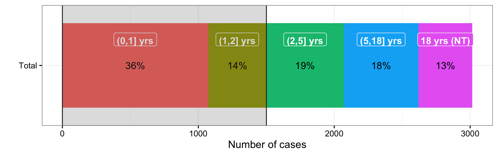
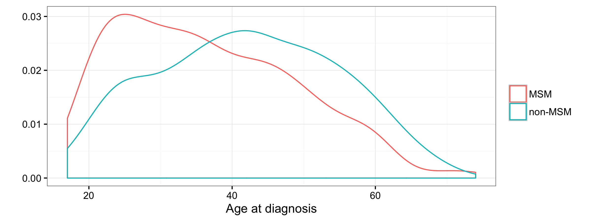
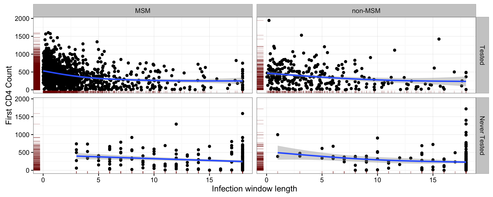
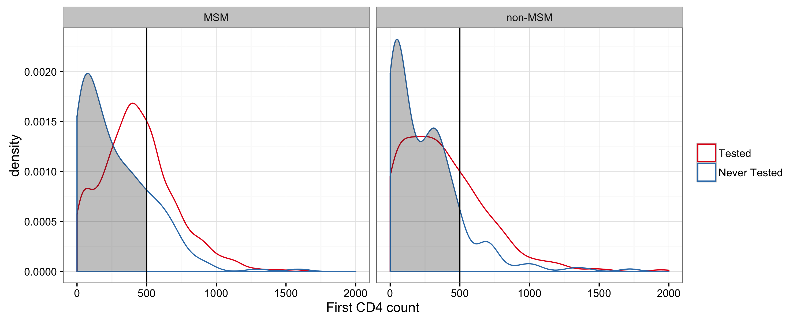
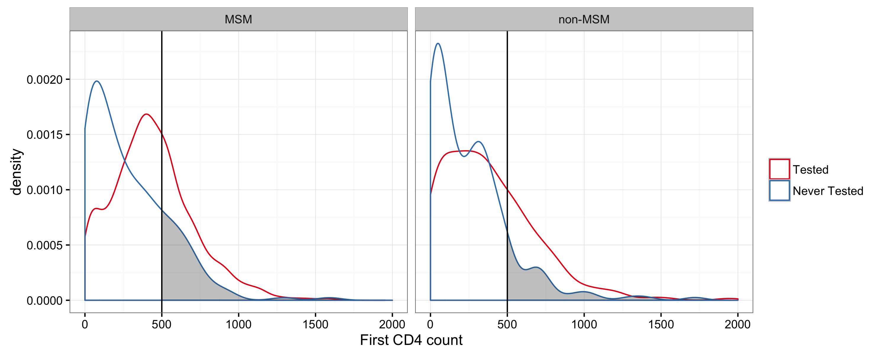
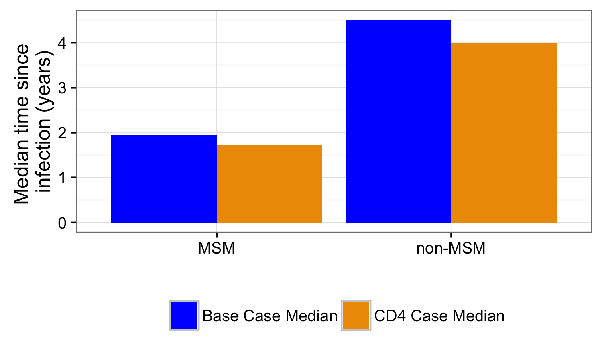

Integrating CD4 data into undiagnosed estimates
========================================================
author: Martina Morris & Jeanette Birnbaum
date: 
autosize: true
transition: fade
width: 1920
height: 1080


Project Goal
========================================================

**To use CD4 data to _increase the precision_ of undiagnosed estimates from the testing history model** 

*Why* 
- Negative tests that are many years prior to diagnosis, i.e. "long infection windows", are not very informative regarding time of infection
- CD4 at diagnosis can indicate recency of infection

*How*
- From literature, identify typical times to infection for various CD4 counts
- Use this to update the probability of infection within long infection windows

*Impact in WA*
- Our pre-analysis of CD4 measurements in WA indicates that using CD4 will increase the precision of our undiagnosed estimates but will not significantly change the estimated number of undiagnosed cases
- The main impact of integrating CD4 will be to increase our confidence in the estimates 

Reminder: the testing history method
========================================================
type:sub-section

Base Case distributes probability uniformly across the infection window
========================================================
_The hazard (instantaneous rate) of infection at any point within the window is 1/(window length), shown by the red line for two different window lengths. Time=0 refers to time of diagnosis._ 

The red line is lower when the window is longer, since the probability of infection is spread out over a longer time period.

Longer windows have less probability assigned to the recent period
========================================================
_Cumulative probability of diagnosis is the area under the curve. At 1 year prior to diagnosis, for example, the 2-year window assigns greater probability of infection than the 4-year window._ 


Since 1 year is 1/2 of 2 years, 50% of infection probability occurs within 1 year for the 2-year window. In contrast, only 1/4 of 25% of infection probability occurs within 1 year for the 4-year window.

Never-tester assumption gives a window of age-16 or 18 years
========================================================

**For never-testers, we assume a window of 18 years or age-16, whichever is smaller.**

_Example of windows for never-testers of different ages_


The age distribution of never-testers thus influences what window lengths they contribute to the population TID (time from infection to diagnosis).

Reminder: testing histories in WA, 2005-2014
========================================================
type:sub-section

59% of cases have testing history (2005-2014)
========================================================

**Testing histories = Tested + Never Tested**

_Breakdown of testing histories in WA HIV cases 2005-2014._


Total N=5148 <br>
N with testing history N=3016.

43% of non-MSM have testing histories, versus 66% of MSM
========================================================
_Testing history breakdown by MSM status. Percents are within MSM status group. Total N=5148._


MSM comprise about 2/3 of cases.<br>
What is driving differential response rates?

Half the windows are 2 years or shorter
========================================================
_Distribution of infection window lengths in years (N=3016). Labels indicate bounds, e.g. (0,1] includes windows>0 and <=1. The 18-year windows imputed because of the assumption for never-testers are labeled as 18 (NT)._



50% have windows between 0 and 2 years (red plus gold). Our assumption for never-testers almost doubles the number of windows >=5 years (blue plus purple).

More than half of non-MSM windows are over 5 years
========================================================
_Distribution of infection window lengths for non-MSM (top) and MSM. Percents are within MSM status groups._


The 18-year assumption for never-testers is almost 4x more common among non-MSM (31%) than among MSM (7%).

Longer non-MSM windows reflect more concurrent dx
========================================================
_Percent of cases with a concurrent AIDS diagnosis at time of HIV diagnosis, by MSM status._


Longer non-MSM windows also reflect older never-testers
========================================================
_Age distribution of never-testers in WA 2005-2015, by MSM status (pink=MSM)._

Mean age at diagnosis among never-testers is 42 in non-MSM, versus 36 in MSM <br>
Remember the assumption for never-testers: window=min(age-16,18). Cases older than 16+18=34 will all have 18-year windows.

In WA, non-MSM are where precision can be increased
========================================================
**Whether it's using BED, CD4, or concurrent AIDS dx, etc**
- Short testing intervals in MSM = low uncertainty regarding time of infection

**Increasing precision will not necessarily decrease undiagnosed estimates**
- More precise estimates will deviate from the Base Case inasmuch as the additional information changes the probability of infection within the window

**Total population estimates will not change greatly, but our confidence in them will increase**
- Non-MSM are only 1/3 of the sample
- Non-MSM estimates will change more than MSM estimates

Methods: integrating CD4 into the testing history method
========================================================
type: sub-section

Under Base Case, long windows = low probability of recent infection
========================================================

Window Length | If CD4 unknown, infection probability is mostly:
---- | ----------------------------------
Short  | Recent  
Long  | Non-recent  

Long window but high CD4 indicates a higher likelihood of recent infection
========================================================

Window Length | If CD4 unknown, infection probability is mostly: | CD4=Low | CD4=High
---- | ---------------------------------- | ----------| -------------------
Short | Recent | Recent (fast progressor?) | Recent
Long  | Non-recent  | Non-recent | **Recent**

_How to define "short" and "long", "low" and "high"?_

Median times to CD4 from the literature
========================================================


**Years it takes for 50% of cases to reach CD4 level:**

CD4 Category | Lodi 2011 | Cori 2015 | Our approximation^* 
-------------|-------------|---------| ---------
>500 | 1.19 | 2.3 | 1.5
350-500 | 4.19 | 4.17 | 4
200-350 | 7.93 | 7.98 | 8
0-200 | | 11.5 | 9

<p style="font-size:30px">
* Simplified median times that are consistent with both sources. For CD4 0-200, we will retain our maximum-window assumption of 18 years. This sets a maximum median time of 9 years
</p>

**Interpretation**: 50% of infection probability should occur within the median time. <br><br>
**Implication**: If a case has CD4>500 at diagnosis, for example, we expect 50% of his infection probability to occur in the 1.5 years prior to dx

<p style="font-size:20px">Lodi S, Phillips A, Touloumi G, Geskus R, Meyer L, Thiébaut R, et al. Time from human immunodeficiency virus seroconversion to reaching CD4+ cell count thresholds <200, <350, and <500 Cells/mm3: assessment of need following changes in treatment guidelines. Clin Infect Dis Off Publ Infect Dis Soc Am. 2011 Oct;53(8):817–25
<br><br>
Cori A, Pickles M, van Sighem A, Gras L, Bezemer D, Reiss P, et al. CD4+ cell dynamics in untreated HIV-1 infection: overall rates, and effects of age, viral load, sex and calendar time. AIDS Lond Engl. 2015 Nov 28;29(18):2435–46.
</p>


Strategy: re-allocate infection probability given CD4 at diagnosis
========================================================

**Base Case**: 50% infection probability is in each half of the window

_In the example of a window of 18 years, 50% probability of infection is spread across years 0-9 prior to dx_


Strategy: re-allocate infection probability given CD4 at diagnosis
========================================================

**CD4 Case**: 50% of infection probability is shifted into the CD4-based median window

_For a window of 18 years and various CD4 bins at diagnosis, the graphs show the Base Case (red) versus CD4 Case (blue) distribution of the probability of infection within the window. Shading indicates the new placement of 50% of infection probability._



Impact will come from high CD4s in people with "long" windows
========================================================

CD4 Category | CD4 Median | Impacts windows longer than 
-------------| --------- | ----------------------------
>500 | 1.5 | 3
350-500 | 4 | 8
200-350 | 8 | 16

**Degree of impact will depend on how much longer windows are than 2x the CD4-based median** 
* 18-year windows among individuals with CD4>500 will provide much greater impact than 4-year windows, for example
* Even 18-year windows will have minimal impact among CD4 200-350, since the Base Case median for 18-year windows is 9 years and the CD4-based median is 8 years (not much difference)

Results: CD4 in WA cases
========================================================
type: sub-section

72% of cases with testing history also have useable CD4 data
========================================================

```
        cd4cat cd4_days_cat infBreaks  N
1      [0,200)      (30,60]     [0,3) 14
2      [0,200)      (30,60]     [3,8) 17
3      [0,200)      (30,60]    [8,16)  2
4      [0,200)      (30,60]   [16,18] 23
9    [200,350)      (30,60]     [0,3) 28
10   [200,350)      (30,60]     [3,8)  9
11   [200,350)      (30,60]    [8,16)  7
12   [200,350)      (30,60]   [16,18]  7
17   [350,500)      (30,60]     [0,3) 40
18   [350,500)      (30,60]     [3,8)  9
19   [350,500)      (30,60]    [8,16)  4
20   [350,500)      (30,60]   [16,18]  5
25 [500,2e+03]      (30,60]     [0,3) 71
26 [500,2e+03]      (30,60]     [3,8)  9
27 [500,2e+03]      (30,60]    [8,16)  7
28 [500,2e+03]      (30,60]   [16,18]  8
```

CD4 measured within 30 days (add a plot?)

Low CD4 is correlated with long windows, but high variability
========================================================
_Scatterplot of first CD4 count versus infection window length, among CD4-eligible cases (N=2178). Panels are testing status (columns) and MSM status (rows)._ 

* Never testers get a window length of min(age-16, 18 years). <br>

Low CD4 and long windows both imply low probability of recent infection

Low CD4 is more common in never-testers than testers
========================================================
_CD4 distribution density by testing history status (colors) and MSM status (panels)._

Never-testers have CD4 distributions that are much more skewed towards low CD4.

However, some never-testers do have high CD4
========================================================

_CD4 distributions by testing history status (panels) and MSM vs non-MSM status (colors)_


Never-testers with high CD4 are where the CD4 Case will have greatest impact


10% of cases have CD4 indicating a more recent infection than Base Case assumption
========================================================


10% of cases have CD4 indicating more recent infection probability than Base Case assumes
========================================================

CD4 Category | CD4 Median | Impacts windows longer than
-------------| --------- | ---------------------------
>500 | 1.5 | 3
350-500 | 4 | 8
200-350 | 8 | 16



CD4 impacts 7% of MSM versus 17% of non-MSM
========================================================


Results: CD4 impact on median infection point 
========================================================
type: sub-section

Among impacted cases, median infection point decreases by 0.1-0.8 years
========================================================
Median infection point = time by with 50% of infection probability has occurred

_Among impacted cases (10% of all testing histories), median infection points under the Base Case (orange) and CD4 Case (green), by CD4 bin._

_More details included in an appendix slide_

Median windows decrease more in the impacted non-MSM
========================================================
_Among impacted cases, median infection points by Case and MSM status. The impacted MSM are 7% of MSM testing histories, whereas the impacted non-MSM are 17% of all testing histories._

_More details included in an appendix slide_

Results: CD4 impact on TID estimate
========================================================
type: sub-section

CD4 Case decreases % undiagnosed at 1 year by 1-2 percentage points
========================================================

Population| % Undx at 1 year, Base Case | % Undx at 1 Year, CD4 Case | Difference | Relative Difference
----------| --------------------------- | ---------------------------| ---------- | -------
Total | 40.8 | 39.4 | 1.4 | 3.4%
MSM | 33.1 | 31.9 | 1.2 | 3.6%
non-MSM | 64.3 | 62.0 | 2.3 | 3.6%

Overall impact on TID is very subtle
========================================================

_TID S(x) graph for MSM and non-MSM_

Results: CD4 impact on undiagnosed estimates
========================================================
type: sub-section


Mean undiagnosed estimates decrease 5-6% in 2014
========================================================

Population | Base Case | CD4 Case | Difference | Percent Change
---------- | --------- | -------- | ---------- | --------------
Total | 1319.0 | 1247.0 | 72.0 | 5.5
MSM | 604.7 | 568.4 | 36.3 | 6.0
non-MSM | 714.3 | 678.2 | 36.1 | 5.1

Undiagnosed fractions decrease 0.5-0.7 percentage points in 2014
========================================================

Population | Base Case | CD4 Case | Absolute % Difference 
---------- | --------- | -------- | ---------- 
Total | 9.4 | 8.9 | 0.5
MSM | 6.2 | 5.8 | 0.4 
non-MSM | 17.1 | 16.4 | 0.7 

_In relative terms, the 0.7% decrease in non-MSM's undiagnosed fraction is 75% greater than the 0.4% in MSM._

Conclusions, limitations and possibilities
========================================================
type: sub-section

CD4 data indicate that most WA cases with long windows were not recently infected
========================================================

Window Length | If CD4 unknown, infection probability is mostly: | CD4=Low | CD4=High
---- | ---------------------------------- | ----------| -------------------
Short | Recent | Recent (fast progressor?) | Recent
Long  | Non-recent  | Non-recent | **Recent**


In WA, the C

Appendix: Slide Bank
========================================================
type: section

Reminder: 58% of cases have testing history
========================================================


Among testing histories, 79% report have a prior negative test
========================================================


Testing histories come disproportionately from MSM
========================================================
MSM are 66% of all cases.


Recall that never-testers get a window that is either age-16 or 18 years. 


Among impacted cases, median infection point decreases by 0.1-0.8 years
========================================================

Median infection point = time prior to dx within which 50% of infection probability occurs
<!-- html table generated in R 3.3.0 by xtable 1.8-2 package -->
<!-- Mon Sep 19 09:45:45 2016 -->
<table border=1>
<tr> <th> CD4 Bin </th> <th> Number Impacted </th> <th> % of CD4 Bin Impacted </th> <th> Base Case Median </th> <th> CD4 Case Median </th> <th> Difference </th>  </tr>
  <tr> <td> No CD4 within 30d </td> <td align="right"> 0.0 </td> <td align="right"> 0.0 </td> <td align="right"> 2.4 </td> <td align="right"> 2.4 </td> <td align="right"> 0.0 </td> </tr>
  <tr> <td> [500,2e+03] </td> <td align="right"> 172.0 </td> <td align="right"> 24.9 </td> <td align="right"> 1.5 </td> <td align="right"> 0.7 </td> <td align="right"> 0.8 </td> </tr>
  <tr> <td> [350,500) </td> <td align="right"> 66.0 </td> <td align="right"> 13.7 </td> <td align="right"> 1.8 </td> <td align="right"> 1.3 </td> <td align="right"> 0.5 </td> </tr>
  <tr> <td> [200,350) </td> <td align="right"> 58.0 </td> <td align="right"> 13.7 </td> <td align="right"> 2.6 </td> <td align="right"> 2.5 </td> <td align="right"> 0.1 </td> </tr>
   </table>

The impacted cases represent (172+66+58)/3016 = 10% of the cases contributing testing histories.

Median windows decrease more in non-MSM
========================================================

<!-- html table generated in R 3.3.0 by xtable 1.8-2 package -->
<!-- Mon Sep 19 09:45:45 2016 -->
<table border=1>
<tr> <th> Mode </th> <th> CD4 Bin </th> <th> Number Impacted </th> <th> % of CD4 Bin Impacted </th> <th> Base Case Median </th> <th> CD4 Case Median </th> <th> Difference </th>  </tr>
  <tr> <td> MSM </td> <td> [500,2e+03] </td> <td align="right"> 112.0 </td> <td align="right"> 19.4 </td> <td align="right"> 1.3 </td> <td align="right"> 0.6 </td> <td align="right"> 0.7 </td> </tr>
  <tr> <td> MSM </td> <td> [350,500) </td> <td align="right"> 35.0 </td> <td align="right"> 8.8 </td> <td align="right"> 1.3 </td> <td align="right"> 1.0 </td> <td align="right"> 0.3 </td> </tr>
  <tr> <td> MSM </td> <td> [200,350) </td> <td align="right"> 24.0 </td> <td align="right"> 7.6 </td> <td align="right"> 1.9 </td> <td align="right"> 1.8 </td> <td align="right"> 0.1 </td> </tr>
  <tr> <td> MSM </td> <td> [0,200) </td> <td align="right"> 0.0 </td> <td align="right"> 0.0 </td> <td align="right"> 4.0 </td> <td align="right"> 4.0 </td> <td align="right"> 0.0 </td> </tr>
  <tr> <td> non-MSM </td> <td> [500,2e+03] </td> <td align="right"> 60.0 </td> <td align="right"> 52.2 </td> <td align="right"> 2.9 </td> <td align="right"> 1.1 </td> <td align="right"> 1.8 </td> </tr>
  <tr> <td> non-MSM </td> <td> [350,500) </td> <td align="right"> 31.0 </td> <td align="right"> 36.0 </td> <td align="right"> 3.9 </td> <td align="right"> 2.3 </td> <td align="right"> 1.6 </td> </tr>
  <tr> <td> non-MSM </td> <td> [200,350) </td> <td align="right"> 34.0 </td> <td align="right"> 32.1 </td> <td align="right"> 4.7 </td> <td align="right"> 4.4 </td> <td align="right"> 0.3 </td> </tr>
  <tr> <td> non-MSM </td> <td> [0,200) </td> <td align="right"> 0.0 </td> <td align="right"> 0.0 </td> <td align="right"> 6.1 </td> <td align="right"> 6.1 </td> <td align="right"> 0.0 </td> </tr>
   </table>

