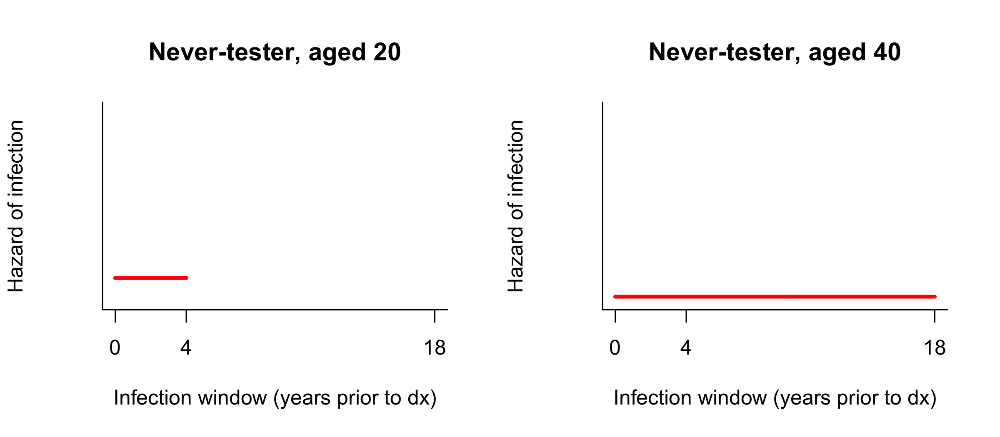
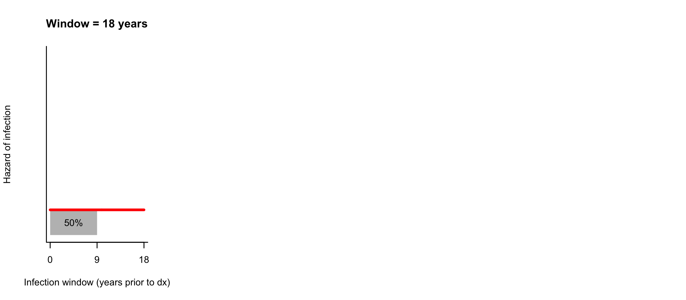

Integrating CD4 data into undiagnosed estimates
========================================================
author: Martina Morris & Jeanette Birnbaum
date: 
autosize: true
transition: fade
width: 1920
height: 1080

Project Goal
========================================================

**To use CD4 data to _increase the precision_ of undiagnosed estimates from the testing history model** 

*Why* 
- Negative tests that are many years prior to diagnosis, i.e. "long infection windows", are not very informative regarding time of infection
- CD4 at diagnosis can indicate recency of infection

*How*
- From literature, identify typical times to infection for various CD4 counts
- Use this to update the probability of infection within long infection windows

*Impact in WA*
- Our pre-analysis of CD4 measurements in WA indicates that using CD4 will increase the precision of our undiagnosed estimates but will not significantly change the estimated number of undiagnosed cases
- The main impact of integrating CD4 will be to increase our confidence in the estimates 

Reminder: the testing history method
========================================================
type:sub-section

Base Case distributes probability uniformly across the infection window
========================================================

_The hazard (instantaneous rate) of infection at any point within the window is 1/(window length), shown by the red line for two different window lengths. Time=0 refers to time of diagnosis._ 

The red line is lower when the window is longer, since the probability of infection is spread out over a longer time period.

Longer windows have less probability assigned to the recent period
========================================================

_Cumulative probability of diagnosis is the area under the curve. At 1 year prior to diagnosis, for example, the 2-year window assigns greater probability of infection than the 4-year window._ 

Since 1 year is 1/2 of 2 years, 50% of infection probability occurs within 1 year for the 2-year window. In contrast, only 1/5 or 20% of infection probability occurs within 1 year for the 5-year window.

Never-tester assumption gives a window of age-16 or 18 years
========================================================

**For never-testers, we assume a window of 18 years or age-16, whichever is smaller.**

_Example of windows for never-testers of different ages_

The age distribution of never-testers thus influences what window lengths they contribute to the population TID (time from infection to diagnosis).

Reminder: testing histories in WA, 2005-2014
========================================================
type:sub-section

59% of cases have testing history (2005-2014)
========================================================

**Testing histories = Tested + Never Tested**

_Breakdown of testing histories in WA HIV cases 2005-2014._

Total N=5148  
N with testing history N=3016.

66% of MSM have testing histories, versus 43% of non-MSM
========================================================
**Testing histories = Tested + Never Tested**

_Testing history breakdown by MSM status. Percents are within MSM status group. Total N=5148._

MSM comprise about 2/3 of cases. 
What is driving differential response rates?

Half of all windows are 2 years or shorter
========================================================

_Distribution of infection window lengths in years (N=3016). Labels indicate bounds, e.g. (0,1] includes windows>0 and <=1. The 18-year windows imputed because of the assumption for never-testers are labeled as 18 (NT)._

50% have windows between 0 and 2 years (red plus gold).

About 1/3 of all windows are 5 years or longer
========================================================

_Distribution of infection window lengths in years (N=3016). Labels indicate bounds, e.g. (0,1] includes windows>0 and <=1. The 18-year windows imputed because of the assumption for never-testers are labeled as 18 (NT)._

Our assumption for never-testers almost doubles the number of windows >=5 years (blue plus purple).

Median window length for MSM is around 1 year, versus 5 years for non-MSM
========================================================

_Distribution of infection window lengths for non-MSM (top) and MSM. Percents are within MSM status groups._

58% of non-MSM have windows 5 years or longer. The 18-year assumption for never-testers is almost 4x more common among non-MSM (31%) than among MSM (7%).

More concurrent dx among non-MSM contribute to their longer windows
========================================================

_Percent of cases with a concurrent AIDS diagnosis at time of HIV diagnosis, by MSM status._

Older never-testers among non-MSM also contribute to longer windows
========================================================

_Density of age distribution of never-testers in WA 2005-2015, by MSM status._

Mean age at diagnosis among never-testers is 42 in non-MSM, versus 36 in MSM  
Remember the assumption for never-testers: window=min(age-16,18). Cases older than 16+18=34 will all have 18-year windows.

In WA, non-MSM are where precision can be increased
========================================================
**Whether it's using BED, CD4, or concurrent AIDS dx, etc**
- Short testing intervals in MSM = low uncertainty regarding time of infection

**Increasing precision will not necessarily decrease undiagnosed estimates**
- More precise estimates will deviate from the Base Case inasmuch as the additional information changes the probability of infection within the window

**Total population estimates will not change greatly, but our confidence in them will increase**
- non-MSM are only 1/3 of the population
- But if cases with long windows tested due to risky exposure, CD4 should help pick up on that

Methods: integrating CD4 into the testing history method
========================================================
type: sub-section

Under Base Case, long windows = low probability of recent infection
========================================================

**CD4 Unknown**

Window Length | If CD4 unknown, infection probability is mostly:
---- | ----------------------------------
Short  | Recent  
Long  | Non-recent  

Long window but high CD4 indicates a higher likelihood of recent infection
========================================================

**CD4 Unknown**

Window Length | If CD4 unknown, infection probability is mostly:
---- | ----------------------------------
Short  | Recent  
Long  | Non-recent  

**CD4 Known**

Window Length | If CD4 unknown, infection probability is mostly: | CD4=Low | CD4=High
---- | ---------------------------------- | ----------| -------------------
Short | Recent | Recent (fast progressor?) | Recent
Long  | Non-recent  | Non-recent | **Recent**

**Those with long windows but high CD4 may be unrecognized recent infections**
 
_How to define "short" and "long", "low" and "high"?_

Median times to CD4 from the literature
========================================================

**Years it takes for 50% of cases to reach CD4 level:**

CD4 Category | Lodi 2011 | Cori 2015 | Our approximation^* 
-------------|:------------:|:-------:|:--------:
>500 | 1.3 | 2.3 | 1.5
350-500 | 4.3 | 4.2 | 4.0
200-350 | 7.9 | 8.0 | 8.0
0-200 | | 11.5 | 9.0 

* Simplified median times that are consistent with both sources. For CD4 0-200, we will retain our maximum-window assumption of 18 years. This sets a maximum median time of 9 years

**Interpretation**: 50% of infection probability should occur within the median time.   
**Implication**: If a case has CD4>500 at diagnosis, for example, we expect 50% of his infection probability to occur in the 1.5 years prior to dx

Lodi S, Phillips A, Touloumi G, Geskus R, Meyer L, Thiébaut R, et al. Time from human immunodeficiency virus seroconversion to reaching CD4+ cell count thresholds <200, <350, and <500 Cells/mm3: assessment of need following changes in treatment guidelines. Clin Infect Dis Off Publ Infect Dis Soc Am. 2011 Oct;53(8):817–25
  
Cori A, Pickles M, van Sighem A, Gras L, Bezemer D, Reiss P, et al. CD4+ cell dynamics in untreated HIV-1 infection: overall rates, and effects of age, viral load, sex and calendar time. AIDS Lond Engl. 2015 Nov 28;29(18):2435–46.

Strategy: re-allocate infection probability given CD4 at diagnosis
========================================================

**Base Case**: 50% infection probability is in each half of the window

_In the example of a window of 18 years, 50% probability of infection is spread across years 0-9 prior to dx_

Strategy: re-allocate infection probability given CD4 at diagnosis
========================================================

**CD4 Case**: 50% of infection probability is shifted into the CD4-based median window

_For a window of 18 years and various CD4 bins at diagnosis, the graphs show the Base Case (red) versus CD4 Case (blue) distribution of the probability of infection within the window. Shading indicates the new placement of 50% of infection probability._

Impact will come from high CD4s in people with "long" windows
========================================================

CD4 Category | CD4 Median | Impacts windows longer than 
-------------| :---------: | :---------:
>500 | 1.5 | 3.0
350-500 | 4.0 | 8.0
200-350 | 8.0 | 16.0

**Degree of impact will depend on how much longer windows are than 2x the CD4-based median** 
* 18-year windows among individuals with CD4>500 will provide much greater impact than 4-year windows, for example
* Even 18-year windows will have minimal impact among CD4 200-350, since the Base Case median for 18-year windows is 9 years and the CD4-based median is 8 years (not much difference)

Results: CD4 in WA cases
========================================================
type: sub-section

28% of cases with testing history do not have useable CD4 data
========================================================

**We exclude cases when their first CD4 count is not within 30 days, or if it's missing** 
Treatment is more likely to begin after 30 days, altering CD4 counts

_Distribution of time of CD4 measurement (x-axis, in days since diagnosis) and CD4 counts (colors) among the 838 individuals who did not have a CD4 count within 30 days._

High CD4s in delayed measurement groups may reflect initiation of treatment

Long windows are weakly correlated with low CD4
========================================================

_Scatterplot of first CD4 count versus infection window length, among CD4-eligible cases (N=2178). Panels are testing status (columns) and MSM status (rows)._ 

* Never testers get a window length of min(age-16, 18 years).  
* Low CD4 and long windows both imply low probability of recent infection

Low CD4 is more common in never-testers than testers
========================================================

_CD4 distribution density by testing history status (colors) and MSM status (panels). Shaded are indicates CD4<500 in never-testers._

The never-tester CD4 distribution suggests some testing in response to symptoms related to low CD4.

However, some never-testers do have high CD4
========================================================

_CD4 distribution density by testing history status (colors) and MSM status (panels). Shaded are indicates CD4>500 in never-testers._

Never-testers with high CD4 are where the CD4 Case will have greatest impact. Never-testers with CD4 200-350 will have minimal impact.

10% of cases have CD4 indicating more recent infection probability than Base Case assumes
========================================================

_Cross-tabulation of window length and CD4 bin, among those with testing history (N=3016). Percents are of the total N. Dot sizes reflect the percents. Red cells are those impacted by the CD4 Case (see table underneath for reminder of impact criteria)._

CD4 Category | CD4 Median | Impacts windows longer than
-------------| --------- | ---------------------------
>500 | 1.5 | 3.0
350-500 | 4.0 | 8.0
200-350 | 8.0 | 16.0

CD4 impacts 7% of MSM versus 17% of non-MSM
========================================================

_Cross-tabulation of window length and CD4 bin, among those with testing history (N=3016) and by MSM status._

**The lowest-impact group are the CD4 250-300 cases with the longest windows**
* MSM: 1%, or 1/7 = 14% of impacted cases
* non-MSM: 5%, or 5/17 = 29% of impacted cases

Results: CD4 impact on median time since infection 
========================================================
type: sub-section

On average, median time since infection decreases by 0.1-0.8 years using CD4 Case
========================================================
**Median time since infection = time by with 50% of infection probability has occurred**

_Among all cases with testing history (N=3016), average median time since infection under the Base Case (orange) and CD4 Case (green), by CD4 bin._

Among all cases, absolute decreases are smaller for MSM than for non-MSM, but percent changes are similar
========================================================
  

_Among all cases with testing history (N=3016), average median time since infection under the Base Case (blue) and CD4 Case (orange), by MSM status._

***
   
_Among all cases with testing history (N=3016), average median time since infection under the Base Case and CD4 Case, and their absolute and relative differences, by MSM status._
<!-- html table generated in R 3.3.0 by xtable 1.8-2 package -->
<!-- Tue Oct 11 21:00:59 2016 -->
<table border=1>
<tr> <th>  </th> <th> Base Case Median </th> <th> CD4 Case Median </th> <th> Absolute Difference </th> <th> Percent Change </th>  </tr>
  <tr> <td align="center"> MSM </td> <td align="center"> 1.94 </td> <td align="center"> 1.72 </td> <td align="center"> -0.22 </td> <td align="center"> -11.54 </td> </tr>
  <tr> <td align="center"> non-MSM </td> <td align="center"> 4.50 </td> <td align="center"> 4.00 </td> <td align="center"> -0.50 </td> <td align="center"> -11.16 </td> </tr>
   </table>

Among impacted cases, MSM actually have slightly greater decreases in median time since infection
========================================================

_Among impacted cases (N=296), density of differences in the median time since infection comparing the Base Case to the CD4 Case. Lines indicate the means of the distributions._

Mean decrease in median time since infection is slighly larger for MSM (3.10 years) than for non-MSM (3.01 years).

Among impacted cases, MSM actually have slightly greater decreases in median time since infection
========================================================

_Among impacted cases (N=296), density of differences in the median time since infection comparing the Base Case to the CD4 Case. Lines indicate the medians of the distributions._

Median decrease in median time since infection is slighly larger for MSM (2.34 years) than for non-MSM (1.94 years).

Total impact of CD4 Case reflects size of impacted population and degree of impact
========================================================

**MSM have a smaller proportion impacted, but impacted cases have slightly greater decreases** 

_Proportion of impact and degree of impact of the CD4 Case. Decreases and percent change refer to the decrease in median time since infection in going from the Base Case to the CD4 Case._

Population| Proportion Impacted | Average Decrease | Total Decrease | Percent Change
----------| :------------: | :--------------:| :----------: | :-------:
MSM | 0.07 | 3.10 | 0.22 | -11.3
non-MSM | 0.17 | 3.01 | 0.51 | -11.3

Results: CD4 impact on TID estimate
========================================================
type: sub-section

Average time undiagnosed decreases by about 6% in both groups
========================================================

**Average time undiagnosed = the mean of the TID curve** 

_Mean TID for the Base Case and CD4 Case, by MSM status_

Population| Base Case | CD4 Case | Difference | Percent Change
----------| :------------: | :--------------:| :----------: | :-------:
MSM | 1.83 | 1.72 | 0.11 | -6.13
non-MSM | 4.38 | 4.13 | 0.25 | -5.74

TID actually changes by 0.39 more percentage points for MSM than non-MSM

Overall impact on TID is subtle
========================================================

**MSM** 

_Time from infection to diagnosis: probability curve (top) and undiagnosed fraction curve (bottom)_

Overall impact on TID is very subtle
========================================================
**non-MSM** 

_Time from infection to diagnosis: probability curve (top) and undiagnosed fraction curve (bottom)_

Results: CD4 impact on undiagnosed estimates
========================================================
type: sub-section

Mean undiagnosed estimates decrease 5-6% in 2014
========================================================

Population | Base Case | CD4 Case | Difference | Percent Change
---------- | :---------: | :--------: | :----------: | :------------:
Total | 1319.0 | 1247.0 | 72.0 | 5.5
MSM | 604.7 | 568.4 | 36.3 | 6.0
non-MSM | 714.3 | 678.2 | 36.1 | 5.1

_Subgroup decreases closely parallel the decreases in mean undiagnosed time (6.13% for MSM and 5.74% for non-MSM)_

Undiagnosed fractions decrease 0.5-0.7 percentage points in 2014
========================================================

Population | Base Case | CD4 Case | Absolute Difference  | Percent Change
---------- | :---------: | :--------: | :----------: | :---------:
Total | 9.4 | 8.9 | 0.5 | 5.3
MSM | 6.2 | 5.8 | 0.4 | 6.5
non-MSM | 17.1 | 16.4 |0.7 | 4.0 

_The fractions take into account diagnosed PLWH. Since the Base Case undiagnosed fraction is much higher for non-MSM, it is less sensitive than the MSM fraction to the CD4 Case's decrease of about 36 undiagnosed cases._

Conclusions, limitations and possibilities
========================================================
type: sub-section

CD4 data indicate that most WA cases with long windows were not recently infected
========================================================

Window Length | If CD4 unknown, infection probability is mostly: | CD4=Low | CD4=High
---- | ---------------------------------- | ----------| -------------------
Short | Recent | Recent (fast progressor?) | Recent
Long  | Non-recent  | Non-recent | **Recent**

In WA, only 10% of cases with testing history had infection windows that indicated less probability of recent infection than indicated by their CD4 count

CD4 Case did not impact subgroups differentially
========================================================

**We expected to see greater impact in non-MSM than MSM**
* non-MSM did have a higher fraction of cases impacted (17% for non-MSM versus 7% for MSM)
* But among the impacted cases, the MSM had larger decreases in their median infection points (50th percentiles: 1.94 years for non-MSM versus 2.34 years for MSM) 
* This translated into slightly higher impacts on mean TID and mean undiagnosed estimates for MSM

Limitations
========================================================

**We prioritize testing history data**
* If testing history indicates more recent infection than CD4 does, we use the testing history
* Little is known about the accuracy of self-reports of the last negative test before diagnosis

**We use CD4 conservatively**
* Literature on CD4 trajectories is fairly sparse
* Data indicate plenty of heterogeneity, hence the need for using a fairly conservative approach for the CD4 Case
 
Future work
========================================================

**CD4 in cases with missing testing history**
* Use CD4 to examine the "missing at random" assumption among cases with missing testing history

**Multiple markers**
* Use a Bayesian approach to combine information from BED, CD4 and concurrent diagnoses

